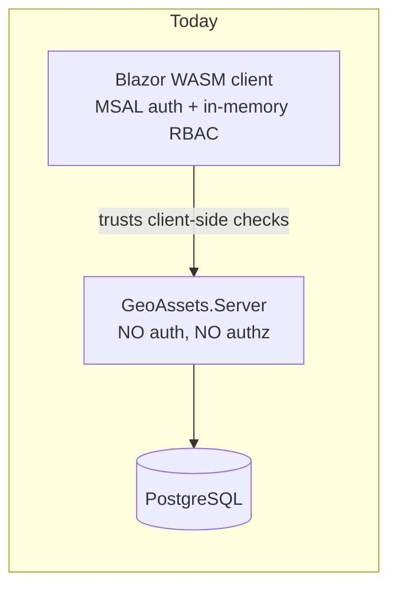
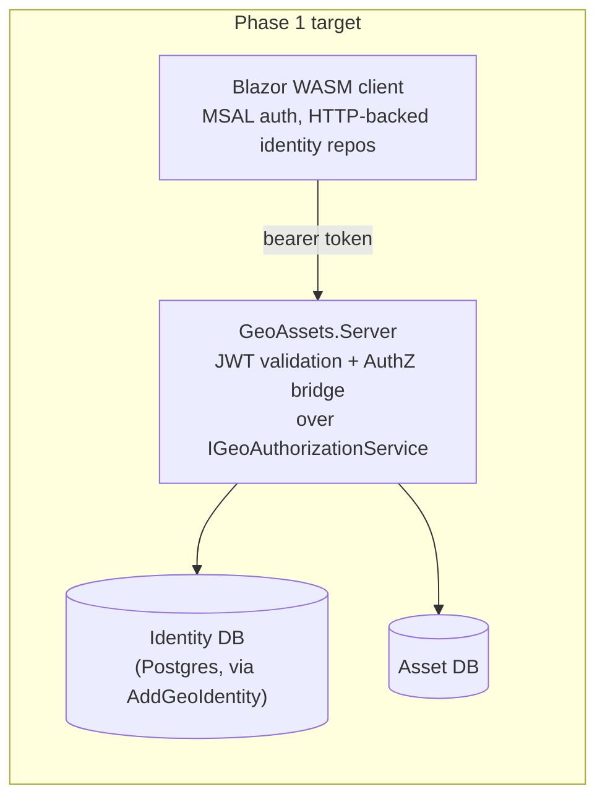

# Role & Organization-Scoped Authorization — Design Reference

This document captures the design for closing GeoAssets' authorization gap and
evolving it toward organization-scoped, multi-identity-provider access control. It
covers the current state (what's built vs. what's only enforced client-side), the
validated security gap, the server-side enforcement plan, the organization/cross-org
resource model, federated authentication, the Entra ID role-governance alternative,
and how all of it maps to Jira tracking.

Everything here is **design**, not yet built, except where explicitly marked
Implemented — most of the work is tracked as Jira epic **XD01-11** and its children.
See `ServiceOrder.md` for the Service Order workflow module's own domain model and
authorization engine (`ServiceOrderRules`), which this document treats as prior art
and extends rather than duplicates.

---

## 1. Current state — what's built vs. what's actually enforced

### The good news: a mature RBAC+ABAC stack already exists

`core/GeoAssets.Identity` has a full model, not a stub:

| Concept | Type |
|---|---|
| User | `AppUser` (linked to the external IdP via `ExternalObjectId`, JIT-provisioned) |
| Role | `AppRole` → `UserRole` (many-to-many) |
| Permission | `AppPermission` (`resource:action` codes) → `RolePermission` |
| Attribute claim | `UserClaim` (e.g. `zone=north`, `department=operations`) |
| Group | `AppGroup` → `UserGroup` |
| Tenant | `Organization` (users belong to exactly one) |
| Policy | `AppPolicy` + `PolicyRequirement` (Role \| Claim \| Permission, All/Any) |
| Evaluator | `GeoAuthorizationService` (`IsInRoleAsync`, `HasPermissionAsync`, `EvaluatePolicyAsync`, `GetAuthorizationContextAsync`) |

A second, independent authorization engine exists for the Service Order workflow
module: `ServiceOrderRules` (`core/GeoAssets.Workflow/Rules`) — a deny-overrides rule
chain over `WorkflowPrincipal`, deliberately decoupled from `GeoAssets.Identity` so
the workflow core has no dependency on any specific identity system. See
`ServiceOrder.md` §5.

### The validated gap: none of it is enforced server-side

`apps/GeoAssets.Server` (the real API — REST features/asset-types, WFS, WMS over
PostgreSQL) has **no authentication or authorization at all**. Only CORS is
configured, which restricts browser JS callers but not a direct HTTP client (curl,
Postman, a script). Meanwhile:

- `AddGeoIdentityWasm()` wires **in-memory, client-side** identity repositories into
  the Blazor WASM app (`apps/GeoAssets.Web/Extensions/GeoIdentityWasmExtensions.cs`),
  seeded on startup via `IdentitySeeder`. Roles/permissions/policies live only in
  browser memory.
- The EF Core identity backend (`GeoAssets.Identity.EFCore.AddGeoIdentity()`,
  Postgres-backed) is fully implemented but **no host registers it**.
- `ServiceOrderRules` only ever runs against the in-memory workflow store inside the
  WASM client (`AddWorkflowInMemory()` in `apps/GeoAssets.Web/Program.cs`).

**Net effect**: today's entire RBAC/ABAC model is UX polish (hides/disables UI
elements) — not a security boundary. Anyone calling `GeoAssets.Server` directly
bypasses all of it.



---

## 2. Roadmap

| Phase | Goal | Status |
|---|---|---|
| **Phase 1** | Turn `GeoAssets.Server` into a real resource server enforcing the existing role/permission/policy model | Designed — Jira XD01-12…18 |
| **Org-scoped resources** | Resources carry an owning `Organization`; actions require role AND same-org, with explicit cross-org grants | Designed — Jira XD01-20…22 |
| **Federated auth** | Support Google, Microsoft-personal, and org-owned identity, all landing in one GeoAssets tenant | Designed — Jira XD01-12, XD01-23 |
| **Phase 2 (backlog)** | Move coarse role *assignment* into Entra ID App Roles, keep fine-grained model local | Designed — Jira XD01-19, explicitly sequenced after Phase 1 |
| **Dispatch-recipient AND-composition** | Prototype of the "(relationship) AND (role)" pattern, in the workflow engine | **Implemented** — XD01-4, commit `16d9912` |

---

## 3. Phase 1 — server-side enforcement

Reuses what's already built instead of inventing a new authorization model.

- **AuthN**: `Microsoft.Identity.Web` validates the Azure AD access token as a JWT
  bearer on every request to `GeoAssets.Server`. The WASM client attaches its MSAL
  token to outgoing calls via the existing REST provider (`AddGeoAssetsRest()`).
  Neither vendor SDK is called directly at either composition root anymore
  (**XD01-48, Implemented**): `GeoAssets.Server`/`GeoAssets.Web` each depend on
  `IGeoAuthenticationProvider` (`GeoAssets.Identity.Authentication`), which
  `AddGeoAssetsAuthentication`/`AddGeoAssetsWasmAuthentication` default to an
  `EntraCiam*AuthenticationProvider` implementation unless a different one is
  passed in — the authentication-layer analog of how the AuthZ bridge below already
  decouples authorization from any specific backend. `ClaimsPrincipalCurrentUserAccessor`/
  `BlazorWasmCurrentUserAccessor` likewise no longer hardcode Entra claim-type
  strings, delegating to a configurable `ClaimMapping` (default: `ClaimMapping.EntraDefault`).
  Actually swapping to a different CIAM vendor remains out of scope — this only
  removes the hardcoding.
- **AuthZ bridge**: a custom `IAuthorizationPolicyProvider` + `IAuthorizationHandler`
  that resolves ASP.NET Core policy names to `AppPolicy` lookups and delegates
  evaluation to the *existing* `IGeoAuthorizationService.EvaluatePolicyAsync` /
  `HasPermissionAsync` — so `.RequireAuthorization("CanEditFeatures")` on a minimal
  API endpoint gets the same evaluation logic the Blazor UI already uses. One source
  of truth for policy definitions, shared by client and server.
- **Identity backend**: `AddGeoIdentity()` (EF Core, already written) gets registered
  in `GeoAssets.Server` against Postgres, with server-side seed data.
- **Endpoints**: REST/WFS/WMS endpoints get `.RequireAuthorization(...)` mapped to
  the existing `AppPermission` catalogue (`features:read`, `features:edit`, etc.).
- **Workflow**: `ServiceOrderRules` gets evaluated server-side, with `WorkflowPrincipal`
  built from real JWT claims via an extended `WorkflowPrincipalFactory`.
- **WASM identity repos**: the in-memory repos get replaced with HTTP-backed repos
  calling new `/api/identity/*` read endpoints, so the client's view of "what can I
  do" matches what the server will actually allow — no more split-brain state.



**This phase is a prerequisite for everything below** — org-scoping and cross-org
grants are moot until something server-side actually checks a token.

---

## 4. Organization-scoped resource authorization

### The requirement

- One GeoAssets identity tenant (users don't need their own separate Entra
  directories).
- **Resources**, not just users, carry an owning `Organization` — e.g. a
  `GeoFeature` or `ServiceOrder` belongs to Org X.
- Authorization is evaluated **against the specific resource**: role AND
  same-org-as-the-resource, not just "does this user have role R" in the abstract.
- **Cross-org exceptions**: a user in O1 can be explicitly granted access to O2's
  resources. Decided granularity: **org-to-org** (not per-user, not per-resource) —
  "everyone in O1 with role X may do action Y on O2's resources," the simplest shape
  that covers the driving use case (a contractor firm servicing a utility's whole
  network).

### Why the existing policy engine can't express this

`AppPolicy`/`GeoAuthorizationService.HasPermissionAsync`/`EvaluatePolicyAsync` are
**subject-only** — "can this user do X," with no notion of which resource X targets.
None of those methods take a resource parameter.

The closest existing prior art is `ServiceOrderRules`, which already evaluates
`(principal, action, order)` as a triple and already resolves an `OrgMember`
relationship (see §6 below for a concrete, already-implemented example of exactly
this AND-composition pattern).

### Design

**1. Resource ownership** — add `OrganizationId` to `GeoFeature`/`AssetType` and to
`ServiceOrder` (neither carries an owning org today; `ServiceOrder` only has
dispatch-*recipient* org matching, a different concept).

**2. A resource-aware authorization primitive** — ASP.NET Core's native
resource-based authorization (`IAuthorizationService.AuthorizeAsync(user, resource,
policy)`, `AuthorizationHandler<TRequirement, TResource>`), not a bespoke mechanism:

```
CanAsync(actionCode, resource):
    if !context.HasPermission(actionCode): return false        // base RBAC gate
    if user.OrganizationId == resource.OrganizationId: return true
    return grants.Any(g =>
        g.IsActive &&
        g.GranteeOrganizationId == user.OrganizationId &&
        g.ResourceOrganizationId == resource.OrganizationId &&
        (g.ResourceType is null || g.ResourceType == resource.Kind) &&
        g.AllowedActions.Contains(actionCode) &&
        (g.RequiredRole is null || context.HasRole(g.RequiredRole)) &&
        (g.ExpiresAt is null || g.ExpiresAt > now))
```

**Unowned-resource exception** (added during XD01-21 implementation, not in the
original design above): every `GeoFeature`/`AssetType` created before XD01-20
shipped defaults to `OrganizationId = Guid.Empty` (that model's own "no
organization assigned" sentinel). Treating `Guid.Empty` as "belongs to no one, so
no one may access it" would have mass-locked out all pre-existing data the moment
this handler shipped — instead, `resource.OrganizationId == Guid.Empty` short-circuits
straight to "allowed" (after the base RBAC gate), same as if same-org matched.

**3. `OrganizationGrant`** — new entity:

```csharp
public sealed class OrganizationGrant
{
    public Guid    Id                     { get; set; }
    public Guid    GranteeOrganizationId  { get; set; }  // O1 — whose members receive access
    public Guid    ResourceOrganizationId { get; set; }  // O2 — whose resources are shared
    public string? ResourceType           { get; set; }  // null = all types, or "ServiceOrder" / "Feature"
    public List<string> AllowedActions    { get; set; }  // permission codes
    public string? RequiredRole           { get; set; }  // optional extra gate
    public DateTime? ExpiresAt            { get; set; }
    public string?  GrantedBy             { get; set; }
    public DateTime GrantedAt             { get; set; }
    public bool     IsActive              { get; set; }
}
```

Index on `(GranteeOrganizationId, ResourceOrganizationId)` — the hot lookup path.

**4. Two integration points**:

| Resource | Mechanism |
|---|---|
| `GeoFeature` / `AssetType` | New `AuthorizationHandler<OrgResourceRequirement, IOrgOwnedResource>`, wired alongside the subject-only checks on REST endpoints (**Implemented — XD01-21**) |
| `ServiceOrder` | New `CrossOrgGrantRule` added to the existing `ServiceOrderRules` deny-overrides chain — an allow-contributor that abstains when no grant applies, same pattern as the other built-in rules (**Implemented — XD01-22**, server-side only; see `ServiceOrder.md` §5/§16) |

---

## 5. Federated authentication

### The requirement

Users must authenticate via Google, Microsoft personal accounts (Outlook/Live), or
a customer organization's own IdP/SSO — all landing in the one GeoAssets tenant from
§4. Today's config (`apps/GeoAssets.Web/wwwroot/appsettings.json`) hardcodes a single
tenant GUID as `Authority` — plain single-tenant Entra ID (`AzureADMyOrg`), which
cannot federate external/social identities.

### Design: Microsoft Entra External ID (CIAM)

One GeoAssets-owned CIAM tenant, configured with:

- **Google** and **Microsoft personal account** as social identity providers.
- **Direct Federation** (SAML/OIDC) connections per customer organization that has
  its own IdP.

All of it still issues one token type from one issuer — server-side JWT validation
(§3) barely changes; what changes is the tenant *type* and its configured providers,
largely a platform/config decision rather than app code.
`ClaimsPrincipalCurrentUserAccessor` already reads the `roles` JWT claim, so no
change needed there for role sourcing.

`Organization` membership becomes something JIT provisioning has to resolve — e.g.
from which federation connection the user authenticated through (deterministic for
org-SSO logins), or an admin assigns it post-signup for social logins where there's
no natural org signal in the token. **Open question** (not yet decided): does a
social-login user land with no organization until an admin assigns one, or is there
a self-service "join an organization" flow?

---

## 6. Worked example / prior art: dispatch-recipient AND-composition (Implemented)

Before designing the generic resource-aware mechanism in §4, the same
"(relationship) AND (role)" gap was found and fixed in the Service Order workflow
engine — **XD01-4, commit `16d9912`, already on `develop`**. It's the concrete
template §4's `OrganizationGrant.RequiredRole` and §4's `AuthorizationHandler`
follow.

**Problem**: `DispatchRecipientRule` only ever granted `View`/`Annotate` to
org/group/direct dispatch recipients — never `Assign`/`Dispatch`/`Execute`/`Reject`.
Granting those required a *global* role grant (`RoleBasedActionRule`), over-broad
because it would apply to every order, not just ones dispatched to that recipient.

**Fix**: `DispatchRecipientRule` now takes an optional `recipientRoleGrants` map
(`IReadOnlyDictionary<string role, IReadOnlySet<OrderActionType>>`), plumbed through
`ServiceOrderRules`'s constructor and `ServiceOrderRulesOptions.RecipientRoleGrants`.
A role only unlocks an action on orders **actually dispatched** to the principal:

```csharp
public bool? Evaluate(OrderActionType action, RuleEvaluationContext ctx)
{
    if ((ctx.Relationship & _recipientFlags) == 0) return null;

    switch (action)
    {
        case OrderActionType.View:
        case OrderActionType.Annotate:
        case OrderActionType.Accept:
            return true;
    }

    foreach (var (role, actions) in _roleGrants)
        if (actions.Contains(action) && ctx.Principal.HasRole(role))
            return true;

    return null;
}
```

Also added: `OrderActionType.Accept` — a first-class "I am claiming this order" verb,
distinct from `Assign` (done *to* someone else), granted unconditionally to any
recipient alongside `View`/`Annotate`.

Tests (`ServiceOrderRulesTests.cs`) include explicit non-leakage proofs: a matching
role without the dispatch relationship is denied, and a grant on one order doesn't
leak to a different order not dispatched to the same principal — the same proof
shape §4's `OrganizationGrant` design should be tested against.

---

## 7. Phase 2 (backlog) — Entra ID role governance

Explicitly sequenced after Phase 1 ships (role source only matters once something
server-side checks it). Captured here so the analysis isn't lost.

**Migration steps 3–4 below are Implemented (XD01-19)**, generalized to be
provider-agnostic per that ticket's 2026-08-18 rewrite: `GetAuthorizationContextAsync`
sources `Roles` from `CurrentUser.ExternalRoles` (the token's roles claim, read through
the XD01-48 `IGeoAuthenticationProvider`/`ClaimMapping` seam — not an Entra-specific
API), and `UserProvisioningService` no longer grants a default role. The rest of this
section (Entra manifest/App Roles registration, the Graph backfill tooling, admin UX,
eventually dropping `UserRole`) remains backlog — XD01-19's shipped scope was role
*sourcing* only, not the admin-management tooling around it, and stayed deliberately
silent on federated/social sign-in (§5's Organization-resolution open question is
still unresolved).

### What moves to Entra vs. what stays local

| Element | Fate |
|---|---|
| `UserRole` (assignment join table, `AssignRoleAsync`) | Eliminated — assignment lives in Entra `appRoleAssignments` |
| `AppRole` | Becomes a shadow lookup (name → permission set), no longer an assignment target |
| `RolePermission`, `AppPermission` | Unchanged — pure app taxonomy, Entra has no concept of `serviceorders:complete` |
| `AppPolicy`/`PolicyRequirement` | Unchanged — the whole policy engine is untouched |
| `UserClaim` (zone/department) | Stays local — operational data, faster-changing than identity role |
| `AppGroup`/`UserGroup`/`Organization` | Stays local — dispatch/tenancy concept, not access-governance; also avoids Entra's 200-group JWT claim overage |

### Migration

1. Register `appRoles` in the Entra manifest (`Administrator`, `Supervisor`,
   `FieldTechnician`, `ReadOnly`).
2. **Backfill script** (one-time, not an ongoing sync job): a C# console tool using
   `Azure.Identity` + `Microsoft.Graph`, reading source-of-truth via
   `GeoIdentityDbContext`. Assigns **every** current role per user (not just the
   highest — the model already supports multi-role users) via
   `POST /users/{id}/appRoleAssignments`, using a dedicated, temporary,
   high-privilege (`AppRoleAssignment.ReadWrite.All`) app registration deleted right
   after use. Modes: `--dry-run` (default), `--only <ids>` for a pilot rollout,
   `--verify` to diff Entra assignments against expected DB state — required to show
   zero mismatches before the code cutover ships.
3. **(Implemented — XD01-19)** Switch `GeoAuthorizationService.GetAuthorizationContextAsync`
   to source `Roles` from `current.ExternalRoles` (the token) instead of the `UserRole`
   DB join — permissions for each role name still resolve against the local
   `AppRole`/`RolePermission` tables via `IRoleRepository`. `UserRole`/`AssignRoleAsync`
   are kept, unused by this path, as the rollback path this step already called for.
4. **(Implemented — XD01-19)** Drop the JIT default-role grant in
   `UserProvisioningService` — a user with no external role assignment naturally
   gets an empty `Roles` list, already treated as a safe no-permissions default.
5. Retire in-app role-assignment write paths; replace with the admin-UX design below.
6. Drop `UserRole` once confident.

### Admin UX for role assignment

No in-app "manage user roles" UI exists today — only the repository surface
(`AssignRoleAsync`, `CanManageUsers` policy). Recommended: build one now, Graph-native
from the start, rather than building it against the soon-to-be-eliminated `UserRole`
table:

- New `GeoAssets.Server` endpoints (`GET /api/admin/users`,
  `PUT /api/admin/users/{id}/roles`), gated by the existing `CanManageUsers` policy
  via the §3 AuthZ bridge.
- The server implements them with **its own app-only Graph credentials**
  (client-credentials flow) — never the calling admin's delegated browser token.
  `AppRoleAssignment.ReadWrite.All` must never reach the WASM client; the server
  verifies the caller is an Administrator via the policy engine, then makes the
  privileged Graph call on their behalf.

### Trade-offs

**Gains**: centralizes role governance in Entra (composable with Conditional
Access/Access Reviews if licensed); deletes a write path currently reachable from
app code; the JIT "auto-grant ReadOnly" default — a likely audit finding —
disappears; pairs naturally with Phase 1 (the `roles` claim is already in the
validated JWT). Entra App Roles also support `allowedMemberTypes: ["Application"]`,
a good conceptual fit for `WorkflowPrincipal.Kind = ActorKind.Agent` (AI-agent
principals, `ServiceOrder.md` §9) — an automation agent could become a real governed
Entra service principal.

**Costs**: role changes need Entra admin access or Graph automation instead of an
in-app flow (mitigated by the admin-UX design above); dynamic/group-based assignment
and Access Reviews need Entra ID P1/P2 licensing; local dev loses the
zero-dependency `IdentitySeeder` role-switching convenience; doesn't address the
existing "roles are global, not per-organization" limitation on `Organization` — §4
solves that independently, at the resource layer, not the role layer.

---

## 8. Jira tracking

Epic: **[XD01-11](https://xdicor.atlassian.net/browse/XD01-11)** — Role &
Authorization Hardening.

| Ticket | Title | Status |
|---|---|---|
| XD01-4 | Dynamic actor / organization-based dispatch routing — authorization rule gap | **Done** |
| XD01-12 | AuthN: federated JWT validation (Entra External ID) | To Do |
| XD01-13 | AuthZ bridge: `IAuthorizationPolicyProvider`/`Handler` over `IGeoAuthorizationService` | To Do |
| XD01-14 | Wire EF Core identity backend into `GeoAssets.Server` + Postgres | To Do |
| XD01-15 | Protect REST/WFS/WMS endpoints with permission policies | To Do |
| XD01-16 | Enforce `ServiceOrderRules` server-side | To Do |
| XD01-17 | WASM client: attach MSAL access token to `HttpClient` calls | To Do |
| XD01-18 | Replace WASM in-memory identity repos with HTTP-backed repos | To Do |
| XD01-19 | [Phase 2 — backlog] Migrate coarse role assignment to Entra ID App Roles | To Do |
| XD01-20 | Data model: `OrganizationId` on owned resources + `OrganizationGrant` | To Do |
| XD01-21 | Resource-aware authorization: `AuthorizationHandler` for features/asset-types | To Do |
| XD01-22 | `ServiceOrderRules`: `CrossOrgGrantRule` for cross-org service order access | To Do |
| XD01-23 | Federated authentication: Google/Microsoft-personal/org-SSO + `Organization` resolution | To Do |
| XD01-24 | Wire `GeoAssets.Workflow` into `GeoAssets.MAUI` (unrelated gap, surfaced while auditing XD01-5) | To Do |

Statuses as of 2026-08-04 — check Jira for current state before relying on this table.

---

## 9. Open questions

- **JIT org resolution for social logins** (§5): no organization assigned by
  default, or self-service join flow? Blocks finalizing XD01-23.
- **`OrganizationGrant` admin UI**: not yet ticketed — flag if wanted before XD01-20
  ships.
- **BFF/token-handler pattern**: considered as a stronger alternative to §3 (removes
  bearer tokens from the browser entirely), not tracked as a ticket yet — worth
  revisiting once Phase 1 ships, especially if the app ends up handling data with
  compliance requirements.
