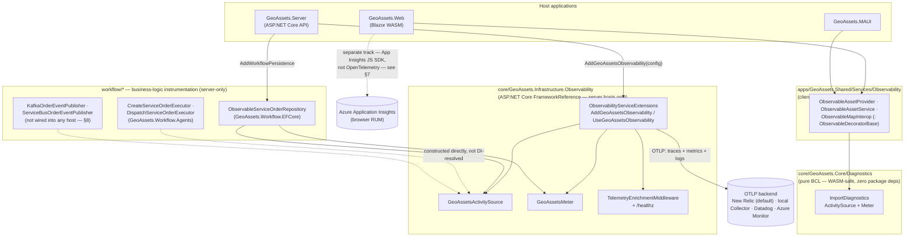
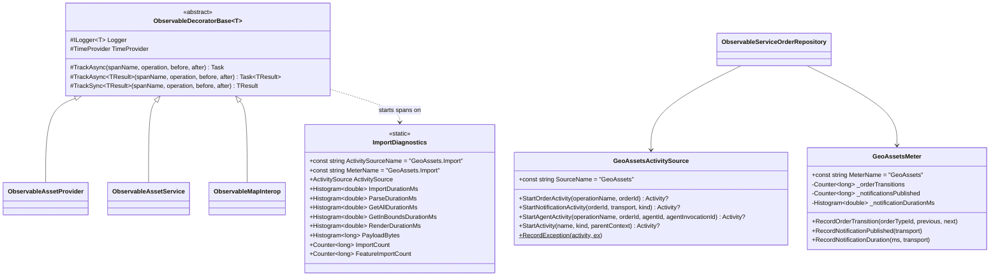
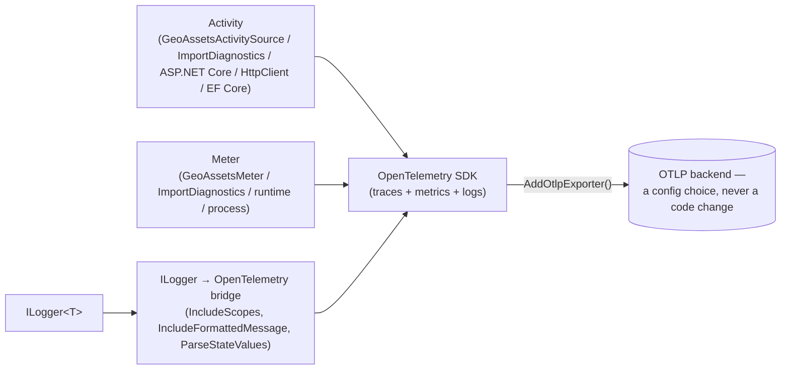
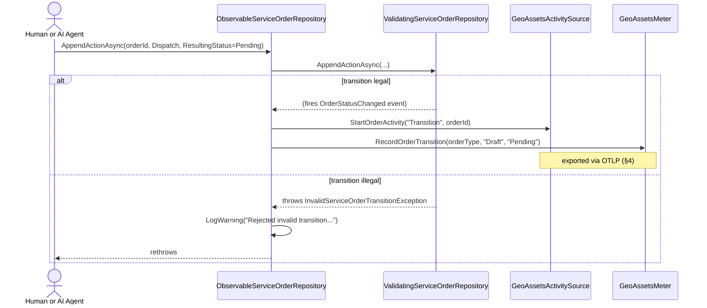

# Observability — Design Reference

This document describes GeoAssets' observability architecture: distributed
tracing, metrics, structured logging, and client-side telemetry, and how they
fit together across the three host applications (`GeoAssets.Server`,
`GeoAssets.Web`, `GeoAssets.MAUI`). It covers the shared instrumentation
primitives, the OTLP export pipeline, business-logic instrumentation coverage,
the client-side decorator pattern, health checks, deployment/vendor
configuration, and known gaps, with diagrams for the architecture, the core
class shapes, and a representative transition-to-telemetry sequence.

The module's code lives in `core/GeoAssets.Infrastructure.Observability`
(the OpenTelemetry SDK wiring — ASP.NET Core-only, server hosts only),
`core/GeoAssets.Core/Diagnostics` (pure-BCL primitives usable from Blazor
WASM), `apps/GeoAssets.Shared/Services/Observability` (client-side decorator
chain), and instrumentation call sites scattered through
`core/GeoAssets.Workflow`'s infrastructure layer (`workflow/*`). Related:
`ServiceOrder.md` §7/§9 (the Service Order-specific instrumentation this
document generalizes) and the `observability-conventions` skill
(`.claude/skills/observability-conventions/`), which curates the underlying
engineering directives (context propagation, unified pillar correlation,
high-cardinality telemetry, vendor-agnostic instrumentation, SLO-based
alerting, tail-based sampling).

---

## 1. What GeoAssets' observability layer is

GeoAssets emits three correlated telemetry signals — traces, metrics, and
logs — through the OpenTelemetry .NET SDK, exported over OTLP to whatever
backend a deployment points at (New Relic direct by default; a local
Collector for multi-vendor fan-out; Datadog or Azure Monitor as alternate
targets). No application code references a vendor SDK — swapping backends is
a config change (`Observability:Otlp:Endpoint`/`Headers`), never a
recompile.

Two tiers exist because one host in this solution — `GeoAssets.Web` — runs as
Blazor **WebAssembly** in the browser, which cannot host the ASP.NET
Core-oriented OpenTelemetry SDK pipeline at all:

- **Server-side** (`GeoAssets.Infrastructure.Observability`): the full OTel
  SDK — traces, metrics, logs, OTLP export, ASP.NET Core/EF Core/HttpClient
  auto-instrumentation, a `/healthz` endpoint. Used only by
  `GeoAssets.Server`.
- **Client-side** (`GeoAssets.Core.Diagnostics` + the `Observable*` decorator
  chain in `GeoAssets.Shared`): a small set of `ActivitySource`/`Meter`
  primitives with **zero NuGet dependencies**, safe to compile into a WASM
  binary. When no listener is attached (the common WASM case today — no OTel
  exporter runs client-side), every `Activity?` returned is `null` and every
  metric recording is a no-op — the instrumentation costs nothing when
  unobserved.

A third, entirely separate track exists for **browser Real User Monitoring**:
`IAnalyticsService`/`AppInsightsService`, backed by the Azure Application
Insights JavaScript SDK loaded directly in `index.html`. This is not part of
the OpenTelemetry pipeline above — see §7.

---

## 2. Architecture at a glance



| Layer | Responsibility | Key types |
|---|---|---|
| **Infrastructure.Observability** | OTel SDK wiring, OTLP export, `/healthz`, log/trace correlation | `ObservabilityServiceExtensions`, `ObservabilityOptions`, `GeoAssetsActivitySource`, `GeoAssetsMeter`, `TelemetryEnrichmentMiddleware`, `ObservabilityApplicationExtensions` |
| **Core.Diagnostics** | WASM-safe tracing/metrics primitives, no package dependency | `ImportDiagnostics` |
| **Shared.Observability** | Client-side decorator chain (Blazor Web + MAUI) | `ObservableDecoratorBase<T>`, `ObservableAssetProvider`, `ObservableAssetService`, `ObservableMapInterop` |
| **Workflow instrumentation** | Business-logic spans/metrics for the Service Order module | `ObservableServiceOrderRepository`, agent executors' `StartAgentActivity` calls, `KafkaOrderEventPublisher`/`ServiceBusOrderEventPublisher` |
| **Client RUM** | Browser telemetry via a vendor JS SDK, decoupled behind an interface | `IAnalyticsService`, `AppInsightsService` |

---

## 3. Core building blocks



- **`GeoAssetsActivitySource`** wraps one process-wide `ActivitySource`
  (`"GeoAssets"`) behind semantically-named `Start*Activity` helpers so call
  sites never construct raw `Activity` objects or repeat tag names.
  `StartActivity` returns `null` when nothing is listening — every helper
  built on it is a genuine no-op absent a registered listener, which is what
  makes it safe to call unconditionally from hot paths. `RecordException` is
  a `static` helper (`activity.AddException(ex)` +
  `SetStatus(ActivityStatusCode.Error, …)`) so the exception-recording
  pattern is identical everywhere it's used, including from `static`
  contexts (`GeoAssetsActivitySource.RecordException(span, ex)` in the agent
  executors, §6).
- **`GeoAssetsMeter`** wraps one process-wide `Meter` (`"GeoAssets"`) with two
  counters and one histogram — all three currently fed exclusively by the
  Service Order module (`ObservableServiceOrderRepository` for
  `geoassets.orders.transitions`; the Kafka/ServiceBus publishers for
  `geoassets.notifications.published`/`.duration`). No other domain metric
  exists yet. Two counters that previously lived here,
  `RecordImport`/`UpdateFeatureCount`, were deleted as confirmed dead code
  (never wired to a real call site — see §9's testing note); the surviving
  three are all live.
- **`ImportDiagnostics`** is deliberately defined in `GeoAssets.Core` (no
  NuGet packages beyond the BCL) specifically so it's reachable from both
  sides of the WASM boundary — the Blazor Shared RCL's decorators (§5) and,
  via `ObservabilityServiceExtensions.WithTracing`/`WithMetrics`
  (`.AddSource(ImportDiagnostics.ActivitySourceName)` /
  `.AddMeter(ImportDiagnostics.MeterName)`), the server-side OTel pipeline
  too — so if a server host ever imports GeoJSON through the same code path,
  its spans/metrics show up in the same exported pipeline without any extra
  wiring.
- **`ObservableDecoratorBase<T>`** is the shared timing scaffold every
  client-side decorator inherits: `TrackAsync`/`TrackSync` start an
  `ImportDiagnostics.ActivitySource` span, run the wrapped delegate, tag
  `duration_ms` via **`TimeProvider`** (not `Stopwatch`/`DateTime.UtcNow` —
  consistent with the rest of the codebase's `TimeProvider` migration,
  XD01-34..39), and record the exception + `ActivityStatusCode.Error` on
  failure before rethrowing.

### File map

| Concept | Path |
|---|---|
| OTel SDK wiring | `core/GeoAssets.Infrastructure.Observability/ObservabilityServiceExtensions.cs` |
| Config binding | `core/GeoAssets.Infrastructure.Observability/ObservabilityOptions.cs` |
| Domain trace helper | `core/GeoAssets.Infrastructure.Observability/GeoAssetsActivitySource.cs` |
| Domain metrics | `core/GeoAssets.Infrastructure.Observability/GeoAssetsMeter.cs` |
| Log/trace correlation middleware | `core/GeoAssets.Infrastructure.Observability/TelemetryEnrichmentMiddleware.cs` |
| `/healthz` + middleware registration | `core/GeoAssets.Infrastructure.Observability/ObservabilityApplicationExtensions.cs` |
| WASM-safe import diagnostics | `core/GeoAssets.Core/Diagnostics/ImportDiagnostics.cs` |
| Client decorator base | `apps/GeoAssets.Shared/Services/Observability/ObservableDecoratorBase.cs` |
| Client decorators | `apps/GeoAssets.Shared/Services/Observability/Observable{AssetProvider,AssetService,MapInterop}.cs` |
| Order-repository decorator | `workflow/GeoAssets.Workflow.EFCore/ObservableServiceOrderRepository.cs` |
| Client RUM abstraction | `apps/GeoAssets.Shared/Services/IAnalyticsService.cs` |
| Client RUM implementation | `apps/GeoAssets.Web/Services/AppInsightsService.cs` |

---

## 4. The OTLP pipeline

`AddGeoAssetsObservability(configuration)` (`ObservabilityServiceExtensions`)
is the single entry point that wires traces, metrics, and logs together:



- **Resource attributes** (`service.name`, `service.version`,
  `deployment.environment` from `ASPNETCORE_ENVIRONMENT`, `host.name`) are
  attached once via `ConfigureResource` and appear on every trace, metric,
  and log line — the mechanism `unified-correlation-of-pillars.md` (the
  observability-conventions skill) calls for.
- **Tracing**: `AddSource(GeoAssetsActivitySource.SourceName)` +
  `AddSource(ImportDiagnostics.ActivitySourceName)` register the two custom
  sources alongside `AddAspNetCoreInstrumentation` (with a `Filter` that
  excludes `/healthz` and `/metrics` from trace noise) and
  `AddHttpClientInstrumentation`; `AddEntityFrameworkCoreInstrumentation` is
  conditional on `Instrumentation:EnableEFCore` (default `true`).
- **Sampler**: `AlwaysOnSampler()` — every trace is exported. The in-code
  comment is explicit that a true tail-based sampling policy (retain 100% of
  errors + P95+ latency, discard most of the rest) requires an OTel
  **Collector** `tail_sampling` processor sitting between this exporter and
  the backend, which is **not deployed in production** today (only a
  local/dev Collector exists — §8). Until one exists, every exported trace
  is billed/stored as-is by whatever OTLP backend is configured (XD01-31's
  explicit, user-acknowledged trade-off).
- **Metrics**: `AddMeter(GeoAssetsMeter.MeterName)` +
  `AddMeter(ImportDiagnostics.MeterName)`, plus ASP.NET Core/HttpClient
  request metrics, and optional runtime (`EnableRuntime`, default `true`)
  and process (`EnableProcess`, default `false`) instrumentation.
- **Logs**: the `ILogger` → OpenTelemetry bridge is **always** registered
  (`services.AddLogging(...AddOpenTelemetry...)`) regardless of whether an
  OTLP endpoint is configured — with no endpoint, logs simply go to the
  console only, so local development never loses log output. `IncludeScopes
  = true` is what makes `TelemetryEnrichmentMiddleware`'s `TraceId`/`SpanId`
  scope values (§5) actually reach the exported log record — GeoAssets has
  no Serilog anywhere in the tree; this bridge is the entire log/trace
  correlation mechanism.
- **Credential handling**: `NEW_RELIC_LICENSE_KEY` (if set) is auto-formatted
  into the `api-key=<value>` OTLP header; `OTEL_EXPORTER_OTLP_HEADERS` (the
  OTel SDK's own standard env var) takes precedence over both the auto-formatted
  key and any `Otlp:Headers` config value. Neither appsettings.json nor this
  extension ever hardcodes a credential — see §8 for how `GeoAssets.Server`'s
  own `appsettings.json` is structured (endpoint only, no header) and
  contrast with §9's finding about `GeoAssets.Web`'s client-side RUM key.

---

## 5. Log/trace correlation and health checks

`UseGeoAssetsObservability()` (`ObservabilityApplicationExtensions`),
called after `UseAuthentication()`/`UseAuthorization()`, registers two
things:

1. **`TelemetryEnrichmentMiddleware`** — wraps every request in a
   `logger.BeginScope(...)` carrying `RequestPath`, `RequestMethod`, and
   — when `Activity.Current` is non-null — `TraceId`/`SpanId`/`TraceFlags`,
   plus `UserId` (from the `oid`/`sub` claim or `Identity.Name`) when the
   caller is authenticated. Every log line emitted during that request
   inherits the scope, so a log entry and the trace it happened inside are
   correlatable in the OTLP backend without any manual `logger.LogInformation("...{TraceId}", ...)`
   plumbing at each call site.
2. **`/healthz`** — a liveness endpoint (`UseHealthChecks`) returning
   `{"status":"healthy"|"unhealthy"|"degraded"}`, excluded from traces by
   the `AddAspNetCoreInstrumentation` filter noted in §4 so health-check
   polling doesn't pollute trace volume.

**A real production incident lives here.** `UseHealthChecks` throws
`InvalidOperationException` **at host-startup time** if
`services.AddHealthChecks()` was never called — `GeoAssets.Server`'s
`Program.cs` didn't call it until XD01-45 (2026-08-16) discovered the gap via
a new integration test using `Microsoft.AspNetCore.TestHost` (the first use
of that package in this repo). The fix — one line,
`builder.Services.AddHealthChecks();` — is already in `develop`
(`a1515eb`), but it's worth knowing this class of bug (a DI prerequisite
that only surfaces at startup, not at compile time) exists and is now
covered by a permanent regression test in
`ObservabilityApplicationExtensionsTests`.

---

## 6. Business-logic instrumentation coverage

Infrastructure export (§4) and business-logic instrumentation are two
separate concerns — the SDK wiring being correct doesn't mean the code that
matters actually calls it. As of this writing, three places in the Service
Order module (`ServiceOrder.md` is the domain-level reference) do:

| Call site | What it emits | Where |
|---|---|---|
| `ObservableServiceOrderRepository` | `ServiceOrder.Transition` span + `geoassets.orders.transitions` counter on every status change; a `LogWarning` for every transition `ValidatingServiceOrderRepository` rejects | `workflow/GeoAssets.Workflow.EFCore/ObservableServiceOrderRepository.cs` |
| `CreateServiceOrderExecutor` / `DispatchServiceOrderExecutor` | `Agent.Create`/`Agent.Dispatch` spans tagged `order.id`/`agent.id`/`agent.invocation_id`/`decision.allowed`; structured logs for authorization allow/deny and the resulting transition | `workflow/GeoAssets.Workflow.Agents/Executors/` |
| `KafkaOrderEventPublisher` / `ServiceBusOrderEventPublisher` | `Notification.Publish` span (`ActivityKind.Producer`) + `geoassets.notifications.published`/`.duration`; W3C `traceparent` injected into message headers | `workflow/GeoAssets.Workflow.Messaging.{Kafka,ServiceBus}/` |



**A structural constraint shapes where this instrumentation could land.**
`ObservableServiceOrderRepository` lives in `GeoAssets.Workflow.EFCore`, not
`GeoAssets.Workflow` (core) itself — `GeoAssets.Infrastructure.Observability`
carries an ASP.NET Core `FrameworkReference` that `GeoAssets.Workflow` can't
take on, because `AddWorkflowInMemory()` runs inside Blazor WASM
(`GeoAssets.Web/Program.cs`). `AddWorkflowPersistence()` (the EF-backed,
server-only registration) wraps `ObservableServiceOrderRepository` around
`ValidatingServiceOrderRepository`; `AddWorkflowInMemory()` does not, and
never can without breaking the WASM build — so **Service Order status
transitions are only observed when the EF-backed persistence path is in
use** (`GeoAssets.Server`), not when `GeoAssets.Web` runs its default
in-memory backend. `GeoAssets.Workflow.Agents`, by contrast, has no such
constraint — nothing but its own test project references it yet (§8), so it
took the `Infrastructure.Observability` project reference directly; both
executors are constructed via `new` (never DI-resolved, since neither is
wired into a host — §8), so `GeoAssetsActivitySource`/`ILoggerFactory` are
passed as explicit constructor parameters instead.

---

## 7. Client-side observability: two distinct tracks

`GeoAssets.Web`/`GeoAssets.MAUI` carry **two unrelated telemetry paths** that
are easy to conflate because both ultimately report into Azure — do not
assume wiring one covers the other:

1. **OpenTelemetry-style timing decorators** (§3) — `ObservableAssetProvider`,
   `ObservableAssetService`, `ObservableMapInterop`, all built on
   `ImportDiagnostics`. These measure **internal operation timing**
   (repository reads, GeoJSON import/parse, map render calls) and are
   genuinely vendor-neutral: with no listener attached, they cost nothing;
   if a WASM-compatible OTel exporter were ever wired client-side, these
   spans/metrics would flow through it unchanged. Registered identically in
   `GeoAssets.Web/Program.cs` and `GeoAssets.MAUI/MauiProgram.cs` (XD01-43
   made MAUI match Web exactly, including registering `IAssetService` for
   the first time there).
2. **Application Insights JS SDK** (`IAnalyticsService`/`AppInsightsService`)
   — genuine browser **Real User Monitoring**: page views, route changes
   (`enableAutoRouteTracking`), custom events/traces/exceptions/metrics sent
   directly from the browser to Azure Application Insights, loaded via a
   `<script>` tag in `index.html` (`GeoAssets.Web` only — `GeoAssets.MAUI`
   has no equivalent). This is **not OpenTelemetry** and does not go through
   `ObservabilityServiceExtensions` at all; it is a separate,
   Azure-Application-Insights-specific integration behind one interface
   (`IAnalyticsService`, 3 members: `TrackEvent`/`TrackException`/`TrackMetric`)
   with two call sites. `AppInsightsService` itself additionally exposes
   `TrackTrace`/`SetUser`, which are **not** part of `IAnalyticsService` —
   reachable only through the concrete class, not the abstraction.

`GeoAssets.MAUI` deliberately does **not** get `AddGeoAssetsObservability`
or an OTLP exporter (XD01-43's explicit scope decision, not an oversight):
that extension is ASP.NET Core-only and inapplicable to a MAUI client, and
embedding a vendor OTLP credential in a distributed mobile/desktop binary is
a real decompile-and-extract exposure — the same reasoning that keeps the
Application Insights RUM path Web-only rather than adding it to MAUI too.

---

## 8. Host wiring

| Host | `AddGeoAssetsObservability` | `UseGeoAssetsObservability` | Client decorators (§7.1) | RUM (§7.2) | Order-repo instrumentation |
|---|---|---|---|---|---|
| `GeoAssets.Server` | ✅ `Program.cs` | ✅ `Program.cs` | — (no UI) | — | ✅ via `AddWorkflowPersistence` |
| `GeoAssets.Web` | ❌ (WASM — can't) | ❌ | ✅ `Program.cs` | ✅ `index.html` | ❌ (`AddWorkflowInMemory`, no decorator) |
| `GeoAssets.MAUI` | ❌ (deliberate — §7) | ❌ | ✅ `MauiProgram.cs` (XD01-43) | ❌ (not wired) | n/a (no Service Order UI at all — `ServiceOrder.md` §15) |

**Messaging publishers are instrumented but unreachable in production.**
`KafkaOrderEventPublisher`/`ServiceBusOrderEventPublisher` (§6) require
`GeoAssetsActivitySource` as a constructor dependency, but
`AddWorkflowKafka`/`AddWorkflowServiceBus` (`WorkflowKafkaServiceExtensions`/
`WorkflowServiceBusServiceExtensions`) have **zero call sites** anywhere in
`apps/` — no host registers either transport. The instrumentation is real
and tested (§9), but nothing in this repository currently exercises it
outside test code.

---

## 9. Deployment and vendor configuration

`GeoAssets.Server`'s `appsettings.json` ships New Relic as the default,
direct target — **no Collector required**:

```json
"Observability": {
  "ServiceName": "geoassets-server",
  "ServiceVersion": "1.0.0",
  "Otlp": { "Endpoint": "https://otlp.nr-data.net:4317", "Protocol": "Grpc" },
  "Instrumentation": { "EnableEFCore": true, "EnableRuntime": true }
}
```

Set `NEW_RELIC_LICENSE_KEY` and traces/metrics/logs flow; leave it unset and
export is a no-op (logs still print locally — §4). `appsettings.Development.json`
blanks the endpoint by default, so local `dotnet run` exports nothing unless
explicitly configured.

**A local, dev-only Collector** (`deploy/otel/`, XD01-33) exists purely for
multi-vendor fan-out and testing — pointing the SDK at
`otel-collector:4317` inside its Compose network lets `otel-collector-config.yaml`
translate the same OTLP stream out to New Relic, Datadog, *and* Azure Monitor
simultaneously via config alone. **This is not what `GeoAssets.Server` uses
in production** — production talks OTLP directly to New Relic with no
Collector in front, which is also why the `AlwaysOnSampler` trade-off in §4
is real today: there's no `tail_sampling` processor deployed anywhere
outside this local scaffold.

| Vendor | Path | Code change required? |
|---|---|---|
| New Relic | Direct OTLP (`https://otlp.nr-data.net:4317`) | No — shipped default |
| Datadog | Agent's OTLP receiver, or agentless intake (site-dependent) | No |
| Azure Monitor | Only via a Collector running the `azuremonitor` exporter, **or** re-adding the `Azure.Monitor.OpenTelemetry.AspNetCore` distro package directly | Collector: no · Direct: yes (reintroduces the vendor coupling XD01-30 removed) |

`deploy/otel/README.md` documents all three paths in full, including the
one-time Key Vault setup for each vendor's credential
(`deploy/otel/fetch-secrets.sh`) and the Key Vault name
(`geoassets-otel-kv`). `deploy/server/README.md` covers running
`GeoAssets.Server` itself in Docker (direct-to-New-Relic, no Collector,
against a local PostGIS container).

---

## 10. Testing

| Project | Tests | Covers |
|---|---|---|
| `GeoAssets.Infrastructure.Observability.Tests` | 19 | `GeoAssetsActivitySource`, `GeoAssetsMeter`, `ObservabilityServiceExtensions` (sampler config), `TelemetryEnrichmentMiddleware`, `ObservabilityApplicationExtensions` (including a `/healthz`-throws-without-`AddHealthChecks` regression test via `Microsoft.AspNetCore.TestHost`) |
| `GeoAssets.Workflow.EFCore.Tests` | 69 (module total) | Includes `ObservableServiceOrderRepositoryTests` — span/metric emission on valid transitions, `LogWarning` on rejected ones |
| `GeoAssets.Workflow.Agents.Tests` | 19 (module total) | Includes executor instrumentation — `Agent.Create`/`Agent.Dispatch` spans, `decision.allowed` tag, both authorization outcomes |
| `GeoAssets.Workflow.Messaging.Kafka.Tests` | 4 | `KafkaOrderEventPublisher`'s `BuildHeaders` — `traceparent` injection alongside existing bespoke headers |
| `GeoAssets.Workflow.Messaging.ServiceBus.Tests` | 3 | `ServiceBusOrderEventPublisher`'s equivalent header-building path |
| `GeoAssets.Shared.Tests` (Observability subset) | 1 | `ObservableAssetService.ImportAsync`'s `duration_ms` tag, via `FakeTimeProvider` — see §11 for the coverage gap this leaves |

**A real test-flakiness bug was hit and fixed during the Agents
instrumentation work**: `ActivitySource` is process-global, and two test
classes' `ActivityListener`-based capture lists raced under xunit's default
cross-class parallelism, corrupting each other's captured activities. Fixed
by grouping the executor/workflow test classes into one serialized xunit
collection (`[Collection("AgentObservability")]`) — worth knowing before
adding more `ActivityListener`-based tests anywhere in this solution, since
the same race is latent for any new test class that listens on a shared
`ActivitySource`.

---

## 11. Known limitations

- **Consumer-side `traceparent` extraction doesn't exist.** Both messaging
  publishers inject W3C trace context into outbound headers (§6), but there
  is no Kafka or Service Bus **consumer** implementation anywhere in this
  repository to extract and continue that context — confirmed via
  repository-wide search. The propagation code is real and tested in
  isolation; it has never been exercised end-to-end because there's nothing
  on the receiving end yet.
- **Neither messaging transport is wired into a host** (§8) —
  `AddWorkflowKafka`/`AddWorkflowServiceBus` have zero call sites in `apps/`.
  Combined with the point above, the entire publish-side instrumentation
  effort (XD01-32) is currently unreachable outside test code.
- **No production Collector, so no true tail-based sampling** (§4, §9) —
  `AlwaysOnSampler` exports 100% of traces directly to whatever OTLP backend
  is configured; `deploy/otel/` is explicitly local/dev-only scaffolding,
  not a deployed production component. This was a deliberate,
  user-acknowledged trade-off when XD01-31 shipped, not an oversight, but it
  remains the current production behavior.
- **`apps/GeoAssets.Web/wwwroot/appsettings.json` commits a live Azure
  Application Insights instrumentation key** (line ~44, `Observability` →
  duplicated again in the orphaned `AzureMonitor` sub-section below —
  see next bullet) **and the same key is duplicated a second time**,
  hardcoded directly in `index.html`'s inline `<script>` block (§7) — the
  one actually read by the browser at runtime. Tracked as
  [XD01-53](https://xdicor.atlassian.net/browse/XD01-53) (To Do), assessed
  as low-severity since an Application Insights instrumentation key is
  ingestion-only by Microsoft's design (cannot read telemetry or access
  other resources) and is inherently exposed to every browser once the WASM
  app is deployed regardless of what's in git — but rotation is still
  recommended once it's out of the committed file, since the current value
  can't be un-published from git history. The ticket's scope only names the
  `appsettings.json` copy explicitly; this document additionally notes the
  `index.html` copy is the one with actual runtime effect.
- **That same `appsettings.json` `"Observability"` section is entirely
  orphaned dead configuration.** It still uses the *pre*-OTLP-migration
  schema — `AzureMonitor.ConnectionString` and `Sampling.RatioForProduction`
  — neither of which matches current `ObservabilityOptions` (`Otlp`/
  `Instrumentation`) at all, and confirmed via repository-wide search: no
  `.cs` file in `GeoAssets.Web` binds `GetSection("Observability")` or
  references `ObservabilityOptions`. It predates the XD01-29/30 OTLP
  migration and was never removed when the schema changed underneath it.
  Not separately ticketed.
- **Client-side decorator test coverage is thin and uneven.**
  `ObservableAssetService` has one test (§10); `ObservableAssetProvider` and
  `ObservableMapInterop` have **zero** direct unit tests — confirmed via
  repository-wide search of `GeoAssets.Shared.Tests`. Not separately
  ticketed.
- **`IAnalyticsService` is narrower than its implementation** (§7) —
  `AppInsightsService.TrackTrace`/`.SetUser` exist but aren't part of the
  interface, so any caller that only holds `IAnalyticsService` can't reach
  them. Minor, not separately ticketed.
- **Service Order transitions are only observed on the EF-backed path**
  (§6) — `GeoAssets.Web`'s default in-memory backend
  (`AddWorkflowInMemory()`) never gets `ObservableServiceOrderRepository`,
  by the same WASM/`FrameworkReference` constraint documented there. This is
  a structural consequence of the WASM boundary, not an oversight, but it
  means the only environment where Service Order telemetry is genuinely
  absent is exactly the default, zero-config `GeoAssets.Web` setup
  (`ServiceOrder.md` §15's "in-memory backend limitation").
