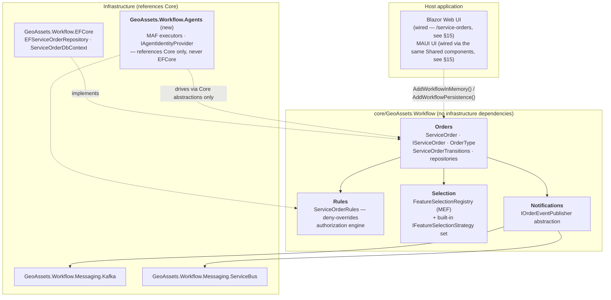
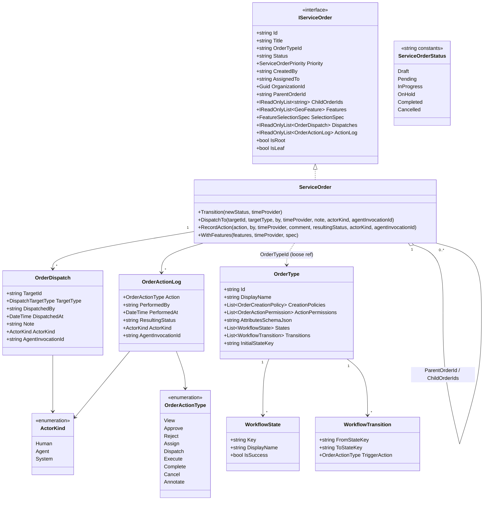
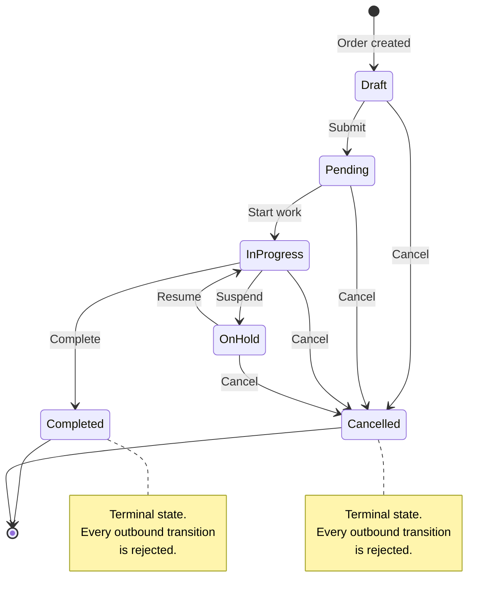
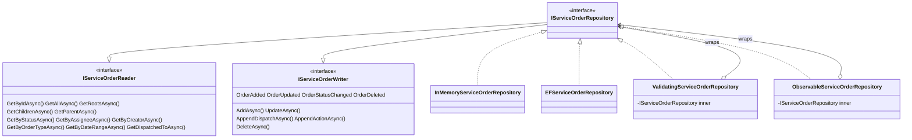
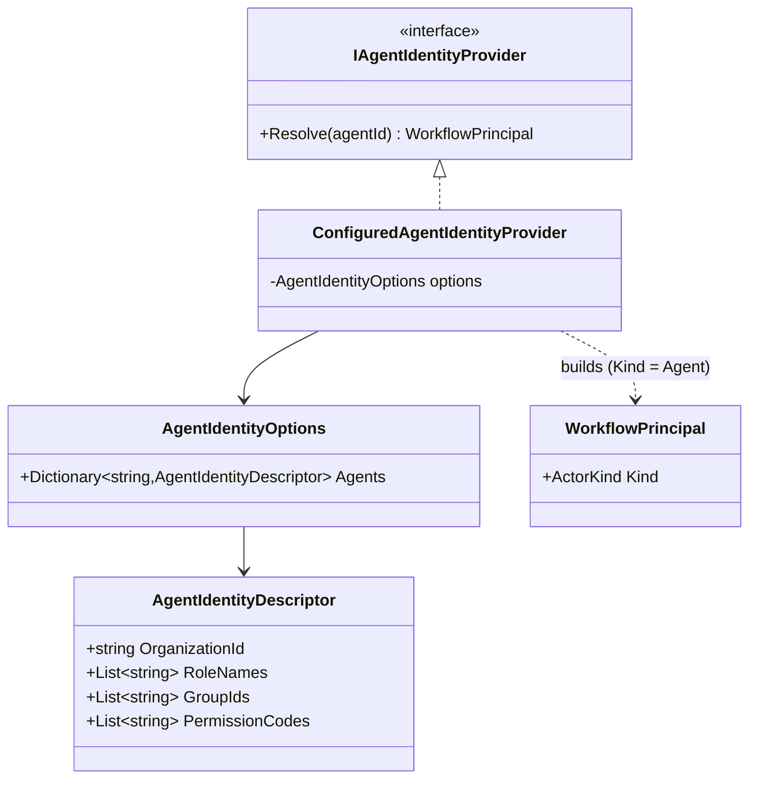
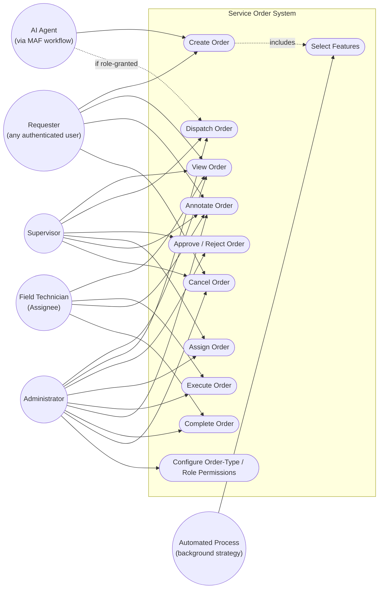
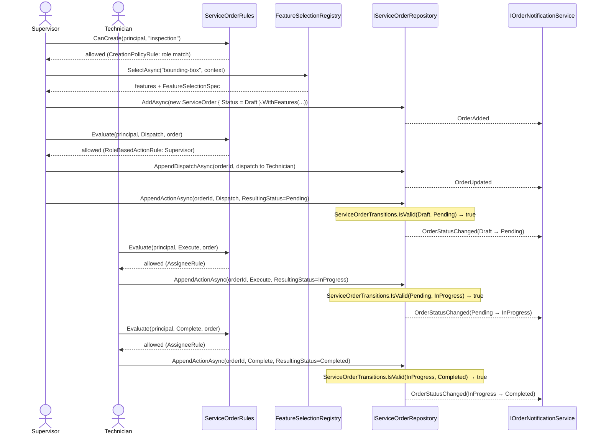
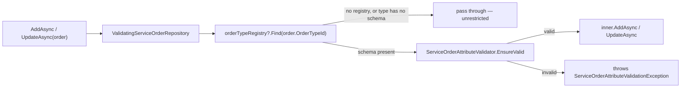

# Service Order — Design Reference

This document describes the design of the **Service Order** module — the workflow
orchestration layer for field/analytical work over georeferenced assets. It covers
the domain model, the authorization engine, the feature-selection subsystem, the
persistence layer, per-order-type attribute validation, **AI-agent participation**,
the Blazor Web UI, and the end-to-end flow, with diagrams for the status lifecycle,
the actors/use-cases, and representative operational sequences (human-driven and
agent-driven).

The module lives in `core/GeoAssets.Workflow` (domain, rules, selection — no
infrastructure dependencies), `workflow/GeoAssets.Workflow.EFCore` /
`workflow/GeoAssets.Workflow.Messaging.*` (persistence and messaging
infrastructure), `workflow/GeoAssets.Workflow.Agents` (AI-agent orchestration —
see §9), and `apps/GeoAssets.Web` / `apps/GeoAssets.Shared` (the human-facing
Blazor UI — see §15).

---

## 1. What a Service Order is

A **Service Order** represents a unit of field or analytical work over a set of
`GeoFeature`s — e.g. "inspect these three transformers," "trace the impact of a
valve failure downstream," "repair this hydrant." An order:

- owns a collection of `GeoFeature`s (the assets involved),
- carries standard workflow metadata (status, priority, timestamps, assignee),
- can participate in a parent/child hierarchy (a roll-up order with per-network-segment
  child orders, for example),
- records **how** its feature set was populated (which selection strategy, with which
  parameters) for audit and reproducibility,
- accumulates a dispatch history and an append-only action log,
- can be created and driven by **either a human or an AI agent** through the exact
  same domain calls — see §9.

---

## 2. Architecture at a glance



| Layer | Responsibility | Key types |
|---|---|---|
| **Orders** | Domain model, status legality, persistence contracts | `ServiceOrder`, `IServiceOrder`, `OrderType`, `ServiceOrderTransitions`, `IServiceOrderRepository` |
| **Rules** | *Who* may perform an action, per order and per order type — human or agent | `ServiceOrderRules`, `IServiceOrderRule`, `IOrderCreationRule` |
| **Selection** | Populating an order's feature set, pluggably | `FeatureSelectionRegistry`, `IFeatureSelectionStrategy` |
| **Notifications** | Publishing state-change events to a transport | `IOrderEventPublisher`, `OrderNotificationService` |
| **EFCore** | Relational persistence | `EFServiceOrderRepository`, `ServiceOrderDbContext` |
| **Messaging.\*** | Kafka / Azure Service Bus transports | `KafkaOrderEventPublisher`, `ServiceBusOrderEventPublisher` |
| **Agents** *(new)* | AI-agent orchestration over the same domain/rules calls a human uses | `CreateServiceOrderExecutor`, `DispatchServiceOrderExecutor`, `IAgentIdentityProvider` |

---

## 3. Domain model



Notes on the model, reflecting decisions made while hardening it:

- **`ParentOrderId` is the only persisted source of truth for hierarchy.**
  `ChildOrderIds` is a *derived* view, recomputed by every repository on every read —
  never write to it directly.
- **`FeatureSelectionSpec`** (on `SelectionSpec`) records which
  `IFeatureSelectionStrategy` populated `Features` and with what parameters, so the
  selection can be audited (see §6).
- **`OrderType`** carries two independent policy tables:
  `CreationPolicies` (who may create an order of this type) and `ActionPermissions`
  (per-action overrides, consulted by `ServiceOrderRules` — see §5) — plus an
  optional `AttributesSchemaJson` validating `Attributes` (see §14), and an
  optional `States`/`Transitions`/`InitialStateKey` workflow graph (see §4).
- **`IServiceOrder.Status` is a plain `string` state key, not an enum.**
  `ServiceOrderStatus` (`Orders/ServiceOrderStatus.cs`) is a static class of
  `const string` fields (`Draft`, `Pending`, …) — existing call sites like
  `ServiceOrderStatus.Draft` keep working unchanged, they just yield a string
  instead of an enum value now. This is what lets an `OrderType` introduce states
  the built-in set never anticipated, with no code change or redeploy (see §4).
- **`ActorKind`** (`Human` / `Agent` / `System`) was added additively to
  `WorkflowPrincipal`, `OrderDispatch`, and `OrderActionLog` — every new member
  defaults to `Human`, so no existing call site changed. It exists purely for
  audit/observability: **authorization and transition logic never branch on it**
  (see §9).
- **`OrganizationId`** (set-once at creation, like `CreatedBy`) marks which
  organization owns the order, via the shared `IOrgOwnedResource` marker interface
  also implemented by `GeoFeature`/`AssetType`. It defaults to `Guid.Empty` ("no
  organization assigned") rather than being nullable, matching this model's own
  `CreatedAt`/`UpdatedAt`-style sentinel-default convention. See §16 for what this
  data-model addition does *not* yet do.

### File map

| Concept | Path |
|---|---|
| Domain entity | `core/GeoAssets.Workflow/Orders/ServiceOrder.cs` |
| Domain interface | `core/GeoAssets.Workflow/Orders/IServiceOrder.cs` |
| Order type + policies + workflow graph | `core/GeoAssets.Workflow/Orders/OrderType.cs` (also `WorkflowState`, `WorkflowTransition`) |
| Order type catalogue | `core/GeoAssets.Workflow/Orders/OrderTypeRegistry.cs` |
| Status string constants | `core/GeoAssets.Workflow/Orders/ServiceOrderStatus.cs` |
| Priority enum | `core/GeoAssets.Workflow/Orders/ServiceOrderPriority.cs` |
| Action enum | `core/GeoAssets.Workflow/Orders/OrderActionType.cs` |
| Actor-kind enum | `core/GeoAssets.Workflow/Orders/ActorKind.cs` |
| Dispatch record | `core/GeoAssets.Workflow/Orders/OrderDispatch.cs` |
| Audit log record | `core/GeoAssets.Workflow/Orders/OrderActionLog.cs` |
| State machine | `core/GeoAssets.Workflow/Orders/ServiceOrderTransitions.cs` |
| Attribute schema validator | `core/GeoAssets.Workflow/Orders/ServiceOrderAttributeValidator.cs` (§14) |
| Concurrency exception | `core/GeoAssets.Workflow/Orders/ServiceOrderConcurrencyException.cs` (§7) |

---

## 4. Status lifecycle — the flow of a Service Order

Every legal status transition is defined in one place, `ServiceOrderTransitions.IsValid`,
and enforced at **every** write path that can change `Status` — the domain entity
(`ServiceOrder.Transition`), both repository implementations' `UpdateAsync`/
`AppendActionAsync`, and the `ValidatingServiceOrderRepository` decorator that wraps
any future implementation automatically. This holds regardless of whether the actor
is a human or an AI agent — the state machine has no concept of *who* is transitioning
the order, only whether the transition itself is legal.

**The graph below is the global default**, used by any `OrderType` that doesn't
define its own — same "empty = unrestricted/default" convention `CreationPolicies`
and `AttributesSchemaJson` already use. An `OrderType` can instead embed its own
`States`/`Transitions`/`InitialStateKey` (mirroring `CreationPolicies`/
`ActionPermissions`) to introduce states or edges the global graph never
anticipated — **with no code change or redeploy** — which is exactly why `Status`
is a plain `string` state key (`ServiceOrderStatus`'s `const string` fields), not a
compiled `enum`: an enum can't gain members at runtime. `ServiceOrderTransitions.IsValid(OrderType?, string, string)`
consults the order's own graph when it defines one, falling back to the graph below
otherwise; `ServiceOrderTransitions.HasTransitionFor` and `IsSuccessState` do the
same for "does a Cancel-triggering edge exist from this state" (used by
`ServiceOrderRules`'s `CreatorRule` — see §5) and "does reaching this state mean
success" (used for `CompletedAt` stamping) respectively. All three built-in order
types (`inspection`, `maintenance`, `emergency-repair`) are seeded with this exact
graph as explicit data (`WorkflowServiceExtensions.SeedDefaultOrderTypes`), so
nothing behaves differently for them today — the fallback exists for any order type
that doesn't bother defining its own graph, not just the built-ins.

Enforcement of a custom graph happens in `ValidatingServiceOrderRepository`
(`UpdateAsync`/`AppendActionAsync`), which already carried an optional
`OrderTypeRegistry` for attribute-schema validation (§14) and now uses it here too.
`InMemoryServiceOrderRepository`/`EFServiceOrderRepository`'s own baked-in checks
are unchanged — global graph only — since every registered host wraps them in
`ValidatingServiceOrderRepository` for the per-type guarantee (see §16 for the
"convention, not compiler" nuance this implies for any *unwrapped* implementation).



Any transition not shown above — skipping straight from `Draft` to `Completed`,
re-opening a `Completed`/`Cancelled` order, moving backward from `InProgress` to
`Pending` — throws `InvalidServiceOrderTransitionException` before anything is
mutated or persisted. Staying in the same status is always a legal no-op (used by
plain metadata updates that don't touch `Status`).

---

## 5. Authorization — the rules engine

`ServiceOrderRules` is a **deny-overrides** evaluator over a chain of
`IServiceOrderRule` instances (for actions on an existing order) and a parallel
chain of `IOrderCreationRule` instances (for creating a new order, which has no
`IServiceOrder` yet).


### Built-in `IServiceOrderRule` chain (registration order)

| Rule | Grants | Notes |
|---|---|---|
| `CreatorRule` | View, Annotate to the creator; Cancel while a Cancel-triggering transition still exists from the order's current state | Status-aware — for an order type with no custom workflow graph this means "still `Draft`/`Pending`" (the historical behavior, via `ServiceOrderTransitions.HasTransitionFor`'s fallback); for a custom graph it's derived from that type's own `Transitions` |
| `AssigneeRule` | View, Execute, Complete, Annotate to the assignee | |
| `DispatchRecipientRule` | View, Annotate, Accept unconditionally to direct/group/org dispatch recipients; Assign/Dispatch/Execute/Reject/etc. when the recipient *also* holds a configured role | The role-gated grants (`recipientRoleGrants`) express "(is a recipient of **this** dispatch) AND (has role X)" — narrower than `RoleBasedActionRule` below, which would grant the action on every order in the system. `Accept` (`OrderActionType.Accept`) is the audited "I am claiming this order" verb, distinct from `Assign` (done *to* someone else) |
| `OrderTypeActionPermissionRule` | Per-`OrderType.ActionPermissions` override | **Overrides** the role-based default below when the order's type defines an entry for the action being evaluated; abstains otherwise. An entry's optional `FromStateKey` (§4) scopes it to one state — e.g. "Approve requires role X, but only from `Pending`" — null (the default) applies regardless of state |
| `RoleBasedActionRule` | Configurable role → action-set mapping (default: `Supervisor` → View/Approve/Reject/Assign/Dispatch/Cancel/Annotate; `Administrator` → everything) | Mapping is data, injected via `ServiceOrderRules`'s constructor or `AddServiceOrderRules` (see §12) — **this is exactly how an AI agent's role (e.g. `"AutomationAgent"`) is granted actions, with zero code change** |
| `CrossOrgGrantRule` (XD01-22) | The action when the principal's organization holds an active cross-org grant covering the order's owning organization | Pure allow-contributor — never denies, only adds an extra allow path on top of the rules above. Grants are pre-resolved onto `WorkflowPrincipal.OrgGrants` (a `WorkflowOrgGrant` DTO, decoupled from `GeoAssets.Identity`'s `OrganizationGrant`) by `ServerWorkflowPrincipalFactory`, server-side only — see `Authorization.md` §4 |

### Built-in `IOrderCreationRule` chain

| Rule | Grants |
|---|---|
| `CreationPolicyRule` | Creation when the principal satisfies at least one `OrderType.CreationPolicies` entry (any-match), or unconditionally when none are defined. Abstains (not denies) when unsatisfied, so a custom creation rule can still grant access another way. |

`PolicyKind` (used by both `CreationPolicies` and `ActionPermissions`) matches on
`Role`, `Permission`, `Group`, or `Organization` against a `WorkflowPrincipal` — a
snapshot record deliberately decoupled from `GeoAssets.Identity`, so the workflow
core has no dependency on any specific identity system — **and no dependency on
`GeoAssets.Workflow.Agents` either.** `WorkflowPrincipal.Kind` (§9) means the same
principal shape represents a human or an agent; `ServiceOrderRules` evaluates both
identically, never branching on `Kind`.

### File map

| Concept | Path |
|---|---|
| Engine | `core/GeoAssets.Workflow/Rules/ServiceOrderRules.cs` |
| Action-rule contract | `core/GeoAssets.Workflow/Rules/IServiceOrderRule.cs` |
| Creation-rule contract | `core/GeoAssets.Workflow/Rules/IOrderCreationRule.cs` |
| Principal snapshot | `core/GeoAssets.Workflow/Rules/WorkflowPrincipal.cs` |
| Relationship flags | `core/GeoAssets.Workflow/Rules/OrderUserRelationship.cs` |
| DI options | `core/GeoAssets.Workflow/Rules/ServiceOrderRulesOptions.cs` |

---

## 6. Feature selection — populating an order

`FeatureSelectionRegistry` discovers `IFeatureSelectionStrategy` implementations via
MEF — built-in assemblies plus any `GeoAssets.Plugin.*.dll` dropped in a plugins
directory — so new strategies are added without modifying the registry.

| Strategy ID | Category | What it does |
|---|---|---|
| `bounding-box` | Spatial | Features inside a drawn rectangle |
| `nearby` | Spatial | Features within a radius of a point |
| `asset-type-filter` | Filter | All features of a given asset type |
| `manual` | Interactive | Explicit list of feature IDs |
| `topology-reachability` | Topology | Upstream/downstream/both from a seed feature |
| `inherit-parent` | Hierarchy | Copies (optionally filtered) the parent order's features |
| `inherit-children` | Hierarchy | Merges all direct child orders' features |
| *(abstract)* `BackgroundProcessSelectionStrategy` | — | Base class for long-running strategies with progress reporting |

Every call to `FeatureSelectionRegistry.SelectAsync` validates that the strategy's
`Parameters` are JSON-serializable **before** running it, so a non-serializable
parameter (a delegate, for instance) fails immediately at the call site instead of
much later when the resulting `FeatureSelectionSpec` is persisted.

**Reading `Parameters` back after a reload.** `System.Text.Json` deserializes an
`object`-typed dictionary value into a boxed `JsonElement`, not its original CLR
type — a raw cast or `Convert.ToDouble` call that only handled the fresh (never
persisted) case would throw `InvalidCastException` on any reloaded order. Every
built-in strategy that reads typed parameters (`bounding-box`, `nearby`,
`asset-type-filter`, `topology-reachability`, `manual`) now reads through
`FeatureSelectionParameters`' accessors (`GetDouble`, `GetString`, `GetEnum<T>`,
`GetValue<T>`, `GetStringList`), which transparently handle both a fresh CLR value
and a `JsonElement` — so a strategy behaves identically whether it's driving a
brand-new selection or replaying one loaded from storage.

---

## 7. Persistence

`IServiceOrderRepository` composes two segregated interfaces so a consumer that only
reads or only writes can depend on just that piece:



- **`UpdateAsync`** persists scalar fields only (title, status, priority, assignee,
  schedule, attributes, features, hierarchy) — it never touches `Dispatches` or
  `ActionLog`.
- **`AppendDispatchAsync`** / **`AppendActionAsync`** insert a single new row each,
  independent of any other concurrent write — replacing an earlier design that tried
  to infer "what's new" by comparing collection lengths, which could silently drop
  an entry under concurrent writers. **This is the exact pair of methods the agent
  executors use** (§9) — never `UpdateAsync`, which would silently no-op the
  dispatch/audit entry.
- **`ValidatingServiceOrderRepository`** decorates any inner repository with
  transition-legality enforcement on `UpdateAsync`/`AppendActionAsync`, **and**
  attribute-schema enforcement on `AddAsync`/`UpdateAsync` (via the optional
  `OrderTypeRegistry` constructor parameter — see §14), so a future implementation
  gets both guarantees automatically instead of having to reimplement them.
  `AddWorkflowInMemory()` and `AddWorkflowPersistence()` register it by default,
  passing through whatever `OrderTypeRegistry` is registered (or `null`, in which
  case attribute validation is a no-op — same "unrestricted by default" behavior as
  no schema at all). A test-only implementation added alongside the agent work,
  `SnapshottingServiceOrderRepository` (see §9), does *not* get this protection when
  used unwrapped — a live, if low-stakes, reminder that this contract is still
  enforced by convention for any repository that isn't wrapped, not by the compiler.
  A shared contract-test suite (`GeoAssets.Workflow.TestKit`'s
  `ServiceOrderRepositoryContractTests`, run unwrapped against `EFServiceOrderRepository`
  in `GeoAssets.Workflow.EFCore.Tests`) now mechanically checks both rules — transition-legality
  rejection and `ChildOrderIds` derivation from `ParentOrderId` on every read — closing
  [XD01-27](https://xdicor.atlassian.net/browse/XD01-27) for that implementation. The
  convention-only caveat remains true and intentional for `FakeServiceOrderRepository`,
  `SnapshottingServiceOrderRepository`, and `RestServiceOrderRepository`, each documented
  at its own definition as an explicit exception rather than an oversight.
- **`ObservableServiceOrderRepository`** decorates any inner repository with
  tracing/metrics/logging for status transitions — a span + a
  `geoassets.orders.transitions` metric (via `GeoAssetsActivitySource`/
  `GeoAssetsMeter`) on every transition the inner repository's
  `OrderStatusChanged` event reports, and a structured warning log for any
  transition the repository rejects (`InvalidServiceOrderTransitionException`).
  Only `AddWorkflowPersistence()` registers it, wrapping
  `ValidatingServiceOrderRepository` (outermost, so a rejection either layer
  raises is still logged) — not `AddWorkflowInMemory()`, since that registration
  runs inside Blazor WASM (`GeoAssets.Web/Program.cs`) and
  `GeoAssets.Infrastructure.Observability` carries an ASP.NET Core
  `FrameworkReference` a WASM client can't take on.
- **`EFServiceOrderRepository.UpdateAsync` detects optimistic-concurrency conflicts,
  including a caller that held a stale in-memory copy across an arbitrary gap (XD01-26).**
  `IServiceOrder.RowVersion` carries `ServiceOrderRecord.RowVersion` (EF `.IsRowVersion()`)
  out to every reader (`ServiceOrderMapper.ToDomain`), and `UpdateAsync` sets it as EF's
  `OriginalValue` for the tracked entity before saving — so the generated `UPDATE ... WHERE
  RowVersion = @original` compares against whatever the *caller* actually read, not merely
  whatever `UpdateAsync`'s own fresh internal re-query happened to see moments earlier. A
  mismatch — another writer changed the order after the caller's read, however long ago —
  raises `DbUpdateConcurrencyException`, translated to `ServiceOrderConcurrencyException`
  (already mapped end-to-end to HTTP 409 by `ServiceOrdersRestApiExtensions`/
  `RestServiceOrderRepository`, so this protection applies over REST too with no transport
  changes). A caller that supplies an empty `RowVersion` (e.g. an order fresh from `AddAsync`,
  never re-read) falls back to the narrower same-call-window check only. `ServiceOrderDetail.razor`'s
  `AssignToMe` is the one production UI write path that reads across a render-cycle boundary and
  now round-trips the token via `BuildSnapshot()`. `FakeServiceOrderRepository`/
  `SnapshottingServiceOrderRepository` (test doubles) and `ValidatingServiceOrderRepository`
  (decorator) deliberately don't implement or duplicate this check — see their own doc comments;
  it's `EFServiceOrderRepository`-specific, since only a real backing store has a true current
  value to compare against.

---

## 8. Notifications

`IOrderNotificationService` builds an `OrderStateChangedEvent` (enriched with the
resolved recipient list) and hands it to an `IOrderEventPublisher`:

| Publisher | Transport | Registration |
|---|---|---|
| `NullOrderEventPublisher` | No-op (default) | `AddWorkflowNotifications()` |
| `KafkaOrderEventPublisher` | Apache Kafka | `AddWorkflowKafka(opts => ...)` |
| `ServiceBusOrderEventPublisher` | Azure Service Bus | `AddWorkflowServiceBus(configuration)` |

The domain and rules layers have zero dependency on any messaging SDK — swapping
transports never touches call sites.

---

## 9. Agentic AI participation

An AI agent can create and drive a Service Order end to end through **the exact same
in-process calls a human-driven caller uses** — `IServiceOrderRepository`,
`ServiceOrderRules`, `ServiceOrderTransitions` — so no domain or authorization code
branches on whether the actor is human or agent. This is implemented in a new
project, `workflow/GeoAssets.Workflow.Agents`, built on
[Microsoft Agent Framework](https://www.nuget.org/packages/Microsoft.Agents.AI.Workflows)
(`Microsoft.Agents.AI.Workflows` 1.15.0), and it references **only**
`GeoAssets.Workflow` (core) — never `GeoAssets.Workflow.EFCore` — so the same
orchestration runs against any storage backend.

### Identity: an agent gets a `WorkflowPrincipal` too



`IAgentIdentityProvider.Resolve(agentId)` turns a registered agent id into a
`WorkflowPrincipal` with `Kind = ActorKind.Agent` — the agent-side counterpart to a
host assembling a human principal from `GeoAssets.Identity` data. `ServiceOrderRules`
evaluates the result exactly like a human's: same relationship/role checks, no
special-casing, because it is the same type.

```json
// appsettings.json
{
  "WorkflowAgents": {
    "Agents": {
      "agent-hydro-01": { "RoleNames": [ "AutomationAgent" ] }
    }
  }
}
```

### Executors: the same domain calls, wired into a workflow graph

| Executor | Does | Authorization check |
|---|---|---|
| `CreateServiceOrderExecutor` | Creates a `ServiceOrder` via `IServiceOrderWriter.AddAsync` | `ServiceOrderRules.CanCreate` — throws if withheld |
| `DispatchServiceOrderExecutor` | Dispatches + activates (`Draft → Pending`) via `AppendDispatchAsync`/`AppendActionAsync` | `ServiceOrderRules.Evaluate(..., Dispatch, ...)` — **leaves the order in `Draft`, untouched, if withheld** (does not throw) |

`EmergencyRepairAgentWorkflow.Build(...)` wires both into a MAF `WorkflowBuilder`
graph shaped exactly like `ServiceOrderTransitions`' `Draft → Pending` edge:
`create → dispatch`, with the workflow's output being whatever `DispatchServiceOrderExecutor`
returns.

### The hybrid design: an agent can stop short, and a human finishes identically

This is the centerpiece of the design. `DispatchServiceOrderExecutor` checks
authorization *before* acting — when the agent's configured role doesn't grant
`Dispatch` for this order type, it returns the order **unchanged, still `Draft`**,
for a human to pick up later. Both paths are proven end to end against the real MAF
runtime:

```mermaid
sequenceDiagram
    actor Agent as AI Agent (via MAF workflow)
    participant Identity as IAgentIdentityProvider
    participant Create as CreateServiceOrderExecutor
    participant Dispatch as DispatchServiceOrderExecutor
    participant Rules as ServiceOrderRules
    participant Repo as IServiceOrderRepository
    actor Human as Human Supervisor

    Agent->>Create: CreateServiceOrderRequest(agentId, orderType, ...)
    Create->>Identity: Resolve(agentId)
    Identity-->>Create: WorkflowPrincipal { Kind = Agent }
    Create->>Rules: CanCreate(principal, orderType)
    Rules-->>Create: allowed
    Create->>Repo: AddAsync(new ServiceOrder { Status = Draft })
    Create-->>Dispatch: ServiceOrderCreated

    Dispatch->>Identity: Resolve(agentId)
    Dispatch->>Rules: Evaluate(principal, Dispatch, order)

    alt Dispatch granted to this agent's role
        Rules-->>Dispatch: allowed
        Dispatch->>Repo: AppendDispatchAsync(orderId, dispatch [ActorKind=Agent])
        Dispatch->>Repo: AppendActionAsync(orderId, Dispatch, ResultingStatus=Pending)
        Dispatch->>Repo: GetByIdAsync(orderId)
        Repo-->>Dispatch: order (Status = Pending)
    else Dispatch withheld (role-grant config doesn't include it)
        Rules-->>Dispatch: denied
        Note over Dispatch: order returned unchanged — still Draft
        Human->>Rules: Evaluate(humanPrincipal, Dispatch, order)
        Rules-->>Human: allowed (Supervisor role)
        Human->>Repo: AppendDispatchAsync(orderId, dispatch [ActorKind=Human])
        Human->>Repo: AppendActionAsync(orderId, Dispatch, ResultingStatus=Pending)
    end
```

Which branch happens is **entirely a matter of the deployment's role-grant
configuration** (§5) — not a code fork. The same `EmergencyRepairAgentWorkflow`
graph, unmodified, produces either outcome depending on whether `"AutomationAgent"`
is granted `Dispatch` that day.

`DispatchServiceOrderExecutor` also re-reads the authoritative state via
`GetByIdAsync` after writing, rather than trusting that `AppendDispatchAsync`/
`AppendActionAsync` happened to mutate the in-memory `order` reference in place —
`InMemoryServiceOrderRepository` does; an EF-backed or remote one won't. The
`SnapshottingServiceOrderRepository` test double exists specifically to make that
distinction observable in tests, after an earlier draft of the executor called
`UpdateAsync` post-mutation and had the bug masked by reference-aliasing.

### Observability

Both executors' `HandleAsync` are wrapped in a `GeoAssetsActivitySource.StartAgentActivity`
span (`Agent.Create`/`Agent.Dispatch`, tagged `order.id`/`agent.id`/`agent.invocation_id`/
`decision.allowed`) and log structurally via `ILogger` — the rule-evaluation outcome
(allow/deny, with `RuleEvaluationResult.Reason` where one exists), the resulting transition,
and any exception (`GeoAssetsActivitySource.RecordException` on the span, plus `LogError` —
except the executors' own intentional authorization denials, which log once at
Warning/Information and aren't re-logged as an unexpected error). Since neither executor is
DI-resolved — `EmergencyRepairAgentWorkflow.Build(...)` constructs them directly — it takes a
`GeoAssetsActivitySource` and an `ILoggerFactory` (not a pre-resolved logger) and calls
`loggerFactory.CreateLogger<T>()` itself for each.

This makes `GeoAssets.Workflow.Agents` depend on `GeoAssets.Infrastructure.Observability`,
which nothing in this project needed before — safe here because, unlike
`GeoAssets.Workflow`'s in-memory repository (§7, used from Blazor WASM), nothing in
`GeoAssets.Workflow.Agents` runs client-side; only its own test project references it today
(no host wires `AddWorkflowAgents`/`EmergencyRepairAgentWorkflow.Build` in yet).

### File map

| Concept | Path |
|---|---|
| Agent identity contract | `workflow/GeoAssets.Workflow.Agents/Identity/IAgentIdentityProvider.cs` |
| Config-bound provider | `workflow/GeoAssets.Workflow.Agents/Identity/ConfiguredAgentIdentityProvider.cs` |
| Creation executor | `workflow/GeoAssets.Workflow.Agents/Executors/CreateServiceOrderExecutor.cs` |
| Dispatch executor | `workflow/GeoAssets.Workflow.Agents/Executors/DispatchServiceOrderExecutor.cs` |
| Workflow graph | `workflow/GeoAssets.Workflow.Agents/Executors/EmergencyRepairAgentWorkflow.cs` |
| DI registration | `workflow/GeoAssets.Workflow.Agents/WorkflowAgentsServiceExtensions.cs` |

---

## 10. Use cases



Which actions a role — human or agent — may perform is not hardcoded per actor
above the built-in defaults; see §5. `UC11` (configuring role grants and
`OrderType.ActionPermissions`) is what lets an administrator narrow or extend any
of the other use cases, per order type or per actor role, without a code change —
it's the same lever that scopes what an AI agent may do.

---

## 11. End-to-end flow — human-driven worked example

A Supervisor creates an inspection order, dispatches it, and a Field Technician
executes and completes it (the agent-driven equivalent is in §9):



If the Technician instead attempted `AppendActionAsync(orderId, Complete,
ResultingStatus=Completed)` while the order was still `Draft`, the repository would
throw `InvalidServiceOrderTransitionException` before mutating anything — the same
enforcement shown in §4 applies regardless of which action, or which kind of actor,
triggered the attempt.

---

## 12. Registering the module

```csharp
// REST-backed (WASM hosts) — talks to GeoAssets.Server, no local database (XD01-129).
services.AddWorkflowRest(apiBaseUrl);
services.AddOrderTypeRegistry();           // seeds "inspection", "maintenance", "emergency-repair"
services.AddWorkflowNotifications();       // no-op publisher by default
services.AddServiceOrderRules();           // one consistently configured singleton for every caller

// EF Core-backed (server-side hosts).
services.AddWorkflowPersistence(o => o.UseSqlServer(connectionString));
services.AddWorkflowKafka(opts => { opts.BootstrapServers = "..."; opts.TopicName = "..."; });
// or: services.AddWorkflowServiceBus(configuration);

// AI-agent participation — from configuration, or inline.
services.AddWorkflowAgents(builder.Configuration);
// or: services.AddWorkflowAgents(opts => opts.Agents["agent-hydro-01"] = new() { RoleNames = ["AutomationAgent"] });
```

`AddWorkflowPersistence()` registers `IServiceOrderRepository` as a
`ValidatingServiceOrderRepository` wrapping the concrete implementation, and
separately registers `IServiceOrderReader` / `IServiceOrderWriter` pointing at
that same instance; it additionally wraps that in an outermost
`ObservableServiceOrderRepository` — see §7 — which requires
`AddGeoAssetsObservability` to have been called first. `AddWorkflowRest()` does
neither wrapper (no validation decorator, no observability decorator) — a known
gap, not by design.

`AddServiceOrderRules()` exists specifically because, before it, every caller
hand-constructed its own `ServiceOrderRules` — a real risk of a human-facing host
and an AI-agent orchestrator silently diverging on role-grant configuration. It
resolves the `OrderTypeRegistry` registered by `AddOrderTypeRegistry` automatically
when present.

---

## 13. Testing

`GeoAssets.Workflow.Tests` and `GeoAssets.Workflow.Agents.Tests` cover the module
end to end — 275 and 19 test cases respectively as of this writing, with
`InMemoryServiceOrderRepository`, `ServiceOrder` (transition logic),
`ServiceOrderTransitions`, `ServiceOrderRules`, `FeatureSelectionRegistry`
(parameter validation), `FeatureSelectionParameters` (the JSON-round-trip
accessors, §6), `ServiceOrderAttributeValidator` (schema validation, §14), and
`ValidatingServiceOrderRepository` all at 100% line/branch coverage. The agent
tests run against the **real MAF runtime** (`InProcessExecution.RunAsync`), not a
mock of it, and specifically cover both authorization outcomes (agent fully
granted vs. withheld `Dispatch`) plus the human-handoff scenario the whole design
rests on.

`GeoAssets.Workflow.EFCore.Tests` (79 test cases) covers `EFServiceOrderRepository`
and `EFOrderTypeRepository` (all CRUD, hierarchy, filtered queries, the
`ServiceOrderConcurrencyException` conflict path, and cascade-delete of an order
type's child collections) against a **real SQLite in-memory database**
(`Microsoft.EntityFrameworkCore.Sqlite`, one held-open connection per test so
multiple `DbContext` instances can share the same schema/data) — not the
`Microsoft.EntityFrameworkCore.InMemory` provider, which does not enforce
optimistic-concurrency tokens and would silently let the concurrency test pass for
the wrong reason. SQLite has no native auto-updating rowversion column type, so the
test-only `SqliteFixture`/`SqliteTestDbContext` add a default value and an
`AFTER UPDATE` trigger via raw SQL to make `ServiceOrderRecord.RowVersion` actually
change on every write, purely in the test harness — production's
`ServiceOrderRecordConfiguration` is unmodified apart from dropping the redundant,
SQLite-incompatible `HasColumnType("nvarchar(max)")` calls on the JSON columns
(EF already defaults an unbounded string to each provider's own unlimited-text type,
so this was a no-op on SQL Server and a syntax error under SQLite). The EFCore test
project references its production counterpart via `InternalsVisibleTo`, letting
`SqliteTestDbContext` layer that one SQLite-only default onto the otherwise-internal
`ServiceOrderRecord` entity without changing its visibility. 8 of those 77 cases
(`EFServiceOrderRepositoryContractTests`) come from `GeoAssets.Workflow.TestKit`'s
`ServiceOrderRepositoryContractTests` — a shared, reusable `IServiceOrderRepository`
correctness suite (transition-legality rejection + `ChildOrderIds` derivation) any
implementation can subclass to opt into (see §7, XD01-27).

These five projects (`GeoAssets.Core.Tests` + `GeoAssets.Workflow.Tests` +
`GeoAssets.Workflow.Agents.Tests` + `GeoAssets.Workflow.EFCore.Tests` +
`GeoAssets.Commands.Tests`) run **653 tests** as of this writing — no longer the
full solution total, since unrelated modules (`GeoAssets.Identity`, `GeoAssets.
Infrastructure.Observability`, `GeoAssets.Server`, messaging transports, etc.)
have since grown their own test projects outside this module's scope.

**Gap:** `GeoAssets.Workflow.EFCore` (`EFServiceOrderRepository`,
`EFOrderTypeRepository`, the mappers, `ServiceOrderDbContext` + configurations,
including the new `RowVersion` concurrency check in §7) has **zero automated test
coverage** — no test project references it, and there's no EF-backed test harness
(e.g. Sqlite in-memory) in the repo yet to extend. Tracked separately (not yet
scheduled).

---

## 14. Attribute schema validation

`ServiceOrder.Attributes` (`Dictionary<string, string>`) is free-form by default —
any key, any value. An `OrderType` can optionally attach a JSON Schema (draft
2020-12, via `JsonSchema.Net`) through `AttributesSchemaJson`; when present, every
write is validated against it.



Because `Attributes` values are always strings, `ServiceOrderAttributeValidator`
tries each value as JSON on its own before falling back to a JSON string — so a
schema author can write real `"type": "integer"` / `"boolean"` / `"number"`
constraints (not just `"type": "string"` plus a regex) against a value that's
stored as the text `"5"`. A value that isn't valid JSON by itself (ordinary free
text like `"Downtown Depot"`) falls back to being validated as a JSON string, as
expected.

```json
{
  "type": "object",
  "properties": {
    "severity":     { "type": "integer", "minimum": 1, "maximum": 5 },
    "hazard_class": { "type": "string", "enum": ["electrical", "gas", "structural"] },
    "incident_ref": { "type": "string", "pattern": "^INC-[0-9]{6}$" }
  },
  "required": ["severity", "hazard_class"],
  "additionalProperties": false
}
```

No schema on an `OrderType` means unrestricted — the same "empty = unrestricted"
convention `CreationPolicies` already uses. None of the three built-in seeded
order types (`inspection`, `maintenance`, `emergency-repair`) set one, so this is
fully backward compatible.

**Scope:** originally `ServiceOrder.Attributes` only — `GeoFeature.CustomAttributes`
had the identical gap (free-form, no schema) but extending validation there was a
materially bigger pass: it's already live in the shipped map UI
(`CustomAttributeEditor` inside `AssetForm.razor`) and spans multiple
`IAssetProvider` implementations. Closed by
[XD01-10](https://xdicor.atlassian.net/browse/XD01-10), which generalizes the same
mechanism to `AssetType.AttributesSchemaJson` + `GeoFeatureAttributeValidator`,
enforced by a `ValidatingAssetProvider` decorator wrapping `IAssetProvider` in
`GeoAssets.Web`, `GeoAssets.Server`, and `GeoAssets.MAUI`. Unlike `OrderType`
(which needs a separate `OrderTypeRegistry`), asset types are already part of
`IAssetProvider`'s own state (`GetAssetTypes()`), so the decorator looks the type
up on its inner provider directly — no registry needed. `AssetForm.HandleSave`
catches the validation exception and shows the errors inline; there is still no
schema-*authoring* UI for either `OrderType` or `AssetType` (schemas are set via
code/API, same as before).

### File map

| Concept | Path (`ServiceOrder`) | Path (`GeoFeature`, XD01-10) |
|---|---|---|
| Validator | `core/GeoAssets.Workflow/Orders/ServiceOrderAttributeValidator.cs` | `core/GeoAssets.Core/Services/GeoFeatureAttributeValidator.cs` |
| Exception | `core/GeoAssets.Workflow/Orders/ServiceOrderAttributeValidationException.cs` | `core/GeoAssets.Core/Services/GeoFeatureAttributeValidationException.cs` |
| Schema field | `core/GeoAssets.Workflow/Orders/OrderType.cs` (`AttributesSchemaJson`) | `core/GeoAssets.Core/Models/AssetType.cs` (`AttributesSchemaJson`) |
| Enforcement point | `core/GeoAssets.Workflow/Orders/ValidatingServiceOrderRepository.cs` | `core/GeoAssets.Core/Providers/ValidatingAssetProvider.cs` |

---

## 15. Host UI (Blazor Web)

`apps/GeoAssets.Web` wires the module with the REST-backed implementation talking
to `GeoAssets.Server` (XD01-8, §15.1) — the only supported backend. The earlier
in-memory implementation and its `ServiceOrders:Backend` config flag were removed
(XD01-129): no runtime picker like assets' provider pool, deliberately, to keep
this footprint small.

```csharp
builder.Services.AddOrderTypeRegistry();

var serviceOrdersApiBaseUrl = config["ServiceOrders:ApiBaseUrl"]
    ?? throw new InvalidOperationException("ServiceOrders:ApiBaseUrl is not configured.");
builder.Services.AddWorkflowRest(serviceOrdersApiBaseUrl);

builder.Services.AddServiceOrderRules();
builder.Services.AddScoped<WorkflowPrincipalFactory>();
```

`WorkflowPrincipalFactory` (`apps/GeoAssets.Shared/Services/`) bridges
`IGeoAuthorizationService` (Identity) into a `WorkflowPrincipal`, built once per
page load from the authenticated user's roles/permissions. `GroupIds` is always
empty — `AuthorizationContext` has no group source without a separate lookup —
which only affects org/group-targeted dispatch rules (§16), not the
Creator/Assignee/Role rules that cover the primary flows.

A new route, `/service-orders`, composes list/create/detail/dispatch components
under `apps/GeoAssets.Shared/Components/ServiceOrders/`, following the same
conventions as the existing asset UI (`EventCallback<T>` up, `[Parameter]` down,
`IServiceOrderRepository` injected directly rather than passed through parents).
`ServiceOrderDetail` checks `ServiceOrderRules.Evaluate(principal, action, order)`
before rendering each action button (Dispatch, Assign to me, Start, Complete,
Cancel, Annotate) — the UI never offers an action the current user can't perform.

| Component | Role |
|---|---|
| `ServiceOrders.razor` | Page shell — list on the left, detail/create on the right |
| `ServiceOrderList.razor` | Search/status-filter list, subscribes to repository events |
| `ServiceOrderCreateForm.razor` | New-order form, filtered to order types `ServiceOrderRules.CanCreate` allows |
| `ServiceOrderDetail.razor` | Read-only fields, rule-gated action buttons, dispatch/action-log timeline |
| `ServiceOrderDispatchDialog.razor` | Target type/id/note modal for `AppendDispatchAsync` |

`apps/GeoAssets.MAUI` reuses these same `GeoAssets.Shared` components as-is —
`WebApp.razor`'s `Router` already scans the whole `GeoAssets.Shared` assembly, so
`/service-orders` becomes reachable the moment the DI graph it needs is registered
(XD01-24). `MauiProgram.cs` wires `AddOrderTypeRegistry()`/`AddWorkflowRest()`/
`AddServiceOrderRules()`/`WorkflowPrincipalFactory` the same way `Program.cs` does
for Web, plus two MAUI-only pieces the Shared components transitively require but
that no MAUI host registered before: a small MAUI-local port of
`IGeoAuthorizationService` (`RestGeoAuthorizationService`, duplicated rather than
shared — see its doc comment — since the Web original lives inside the
non-referenceable `GeoAssets.Web` app project), and `NoOpJsonStringLocalizer`, a
stand-in `IJsonStringLocalizer` that returns every key unchanged (MAUI has no real
translation loader yet — a separate, unscheduled follow-up per
`IJsonStringLocalizer`'s own doc comment) so `LocalizedComponentBase`-derived
components render instead of throwing on a missing registration.

### 15.1 Postgres-backed persistence via GeoAssets.Server (XD01-8)

`apps/GeoAssets.Server` exposes Service Orders and Order Types over REST, reusing
the same Postgres connection/database as assets (workflow tables alongside
`geo_entity`/`asset_type`):

```csharp
builder.Services.AddOrderTypeRegistry();
builder.Services.AddWorkflowPersistence(o => o.UseNpgsql(
    connectionString,
    npgsql => npgsql.MigrationsAssembly("GeoAssets.Server")));
// ...
await app.Services.LoadRegistryFromDbAsync();  // overlay DB-persisted OrderTypes on the seeded defaults
app.MapServiceOrdersApi();  // /api/workflow/service-orders, /api/workflow/order-types
```

`ServiceOrderDbContext` (`workflow/GeoAssets.Workflow.EFCore`) stays
provider-agnostic by design (see its own doc comment), so the Postgres migration
lives in `apps/GeoAssets.Server/Migrations` instead, with `MigrationsAssembly(...)`
pointing EF at it. That migration also adds a `BEFORE UPDATE` trigger
(`touch_service_orders_row_version`) stamping a fresh `RowVersion` on every
`UPDATE` — Postgres has no native auto-updating rowversion type like SQL Server,
so without the trigger, `ServiceOrderRecordConfiguration`'s
`RowVersion.IsRowVersion()` would never actually change and EF's optimistic
concurrency check would silently stop detecting concurrent writers. Mirrors the
same problem `GeoAssets.Workflow.EFCore.Tests`' `SqliteTestDbContext` already
solves for SQLite with its own trigger.

`GeoAssets.Web` always uses this backend, configured via
`ServiceOrders:ApiBaseUrl` (XD01-129 — this used to be an opt-in behind
`ServiceOrders:Backend = "Rest"`, with in-memory as the zero-config default;
that flag and its in-memory alternative are gone) —
`RestServiceOrderRepository`/`RestOrderTypeRepository`
(`workflow/GeoAssets.Workflow.Rest`) implement the same
`IServiceOrderRepository`/`IOrderTypeRepository` interfaces the EF backend
does. Unlike `RestAssetProvider` (cache-first, fire-and-forget writes),
this client is direct and non-caching — every call awaits its own HTTP round trip
and propagates `ServiceOrderConcurrencyException`/`KeyNotFoundException`/
`InvalidServiceOrderTransitionException`/`ServiceOrderAttributeValidationException`
exactly as the EF backend does, translated from HTTP status codes + a small JSON
error envelope (`ServiceOrdersRestApiExtensions` and `RestServiceOrderRepository`
document the shared shape). `UpdateAsync`/`AppendDispatchAsync` don't fire
`OrderStatusChanged` (only `AppendActionAsync` does, with a status pre-fetch) —
the real UI only changes status through `AppendActionAsync`
(`ServiceOrderDetail.razor`'s `RecordAction`), so detecting status changes on the
other two paths would cost an extra round trip for an event no caller observes.

**Not covered by this pass:** the Postgres migration + rowversion trigger haven't
been run against a real Postgres instance (no Postgres available in this
environment) — verify before deploying. `ServiceOrdersRestApiExtensions`'s
endpoints had no integration test coverage — only the underlying repository/client
classes were unit-tested; §15.2 closes this specifically for authorization, the
rest is still open. No schema-authoring or backend-switch UI exists (both are
config/code only, same convention as `OrderType`'s attribute schemas).

### 15.2 Server-side authorization enforcement (XD01-16)

`ServiceOrdersRestApiExtensions`'s write endpoints went straight to the
repository with no authorization check at all — any authenticated (or, before
[XD01-12](https://xdicor.atlassian.net/browse/XD01-12), even anonymous) caller
could mutate any order. Every write on an existing/new order is now gated by
`ServiceOrderRules` (§5) — the same engine the Blazor client evaluates — via a new
`ServerWorkflowPrincipalFactory` (`apps/GeoAssets.Server`), the server-side twin of
`GeoAssets.Shared.Services.WorkflowPrincipalFactory` (§9's "Identity" subsection),
duplicated rather than shared since `GeoAssets.Server` doesn't reference the Blazor
Razor Class Library:

```csharp
builder.Services.AddServiceOrderRules();               // same singleton config as GeoAssets.Web
builder.Services.AddScoped<ServerWorkflowPrincipalFactory>();
```

Endpoint → `OrderActionType` mapping: create → `CanCreate`; dispatch →
`Dispatch`; the action-log endpoint → the entry's own `Action` (whatever the
caller is actually logging). `PUT` (a whole-order replace) and `DELETE` (a hard
delete) have no single corresponding action in the enum, so they reuse the
closest existing verb — `Annotate` and `Cancel` respectively — rather than adding
new ones speculatively; a denied request gets a 403 with a `reason` field naming
the rule that declined. Order Type CRUD is unchanged: that's configuration data,
not a per-order action this engine governs.

`tests/GeoAssets.Server.Tests/ServiceOrderRulesEndpointTests.cs` exercises the
real `MapServiceOrdersApi()` endpoints end-to-end against a `FakeServiceOrderRepository`
(the old `AddWorkflowInMemory()` registration this test host used was removed,
XD01-129), including non-leakage checks (e.g. being an order's creator doesn't
also grant `Dispatch`; being its creator doesn't grant `Complete` on an order
assigned to someone else).

---

## 16. Known limitations

Resolved since the last pass — kept here only as a pointer to where each is now
documented:

- Not wired into a host UI (§15, Blazor Web only); `FeatureSelectionSpec.Parameters`
  type fidelity after reload (§6); no optimistic concurrency signal at all (§7,
  though see the narrower scope noted there).
- **Dispatch routing to an organization/group only granting View/Annotate** —
  `DispatchRecipientRule` now grants `Accept` unconditionally to any dispatch
  recipient plus role-gated Assign/Dispatch/Execute/Reject via `recipientRoleGrants`
  (§5), closed by [XD01-4](https://xdicor.atlassian.net/browse/XD01-4).
- **One hardcoded, global status graph shared by every order type** — `Status` is
  now a plain `string` state key, and an `OrderType` can define its own
  `States`/`Transitions`/`InitialStateKey` graph that fully replaces the global
  default for that type (§4), closed by [XD01-3](https://xdicor.atlassian.net/browse/XD01-3).
- **`GeoAssets.Workflow.EFCore` had zero automated test coverage** —
  `GeoAssets.Workflow.EFCore.Tests` now covers `EFServiceOrderRepository`/
  `EFOrderTypeRepository` against a real SQLite database (§13), closed by
  [XD01-9](https://xdicor.atlassian.net/browse/XD01-9).
- **`GeoFeature.CustomAttributes` had no schema validation** — same gap §14 closed
  for `ServiceOrder.Attributes`, generalized to `AssetType`/`IAssetProvider` (§14's
  "Scope" note), closed by [XD01-10](https://xdicor.atlassian.net/browse/XD01-10).
- **Service Orders were session-scoped only, lost on refresh/restart** —
  `GeoAssets.Server` now exposes them over REST, backed by the same Postgres
  database as assets, with `GeoAssets.Web` opting in via a config flag (§15.1),
  closed by [XD01-8](https://xdicor.atlassian.net/browse/XD01-8).
- **`ServiceOrderRules` (§5) only ever ran against the Blazor client's in-memory
  store — no server host evaluated it, so any authenticated caller could mutate
  any order over REST** — every `GeoAssets.Server` write endpoint on an order now
  evaluates the same rule engine via `ServerWorkflowPrincipalFactory` (§15.2),
  closed by [XD01-16](https://xdicor.atlassian.net/browse/XD01-16).
- **`OrganizationId`/`OrganizationGrant` were data model only — nothing read them
  at authorization time** — `CrossOrgGrantRule` (§5) now grants a `ServiceOrder`
  action when the principal's organization holds a matching active grant,
  server-side only (the Blazor client's own `WorkflowPrincipal` doesn't resolve
  grants yet — no REST endpoint exposes them), closed by
  [XD01-22](https://xdicor.atlassian.net/browse/XD01-22).
- **`IServiceOrderRepository`'s correctness contract was enforced by convention, not
  the compiler** — a shared, reusable contract-test suite
  (`GeoAssets.Workflow.TestKit`'s `ServiceOrderRepositoryContractTests`, §7/§13) now
  mechanically checks transition-legality rejection and `ChildOrderIds` derivation,
  run unwrapped against `EFServiceOrderRepository`. `FakeServiceOrderRepository`,
  `SnapshottingServiceOrderRepository`, and `RestServiceOrderRepository` remain
  outside the suite by design, each now documenting at its own definition *why* it's
  an intentional exception rather than an oversight, closed by
  [XD01-27](https://xdicor.atlassian.net/browse/XD01-27).
- **The concurrency check only covered races within the EF repository's own
  read-then-save window**, not a caller holding a stale copy across a longer gap. The
  `RowVersion` detection itself was done ([XD01-7](https://xdicor.atlassian.net/browse/XD01-7));
  `IServiceOrder.RowVersion` now round-trips it through every reader and back through
  `UpdateAsync` (§7), closed by [XD01-26](https://xdicor.atlassian.net/browse/XD01-26).

What's still genuinely open:

- **No same-organization gate exists for `ServiceOrder` access — only an
  additional cross-org allow path.** `CrossOrgGrantRule` (§5, XD01-22) is
  deliberately an allow-contributor only, per its own design: a caller from a
  *different* organization than an order's `OrganizationId`, with no matching
  grant, is still not blocked by organization alone — Creator/Assignee/Role/
  DispatchRecipient access is entirely organization-agnostic, same as before this
  ticket. Contrast `GeoFeature`/`AssetType`'s `OrgResourceAuthorizationHandler`
  (XD01-21, `Authorization.md` §4), which *does* enforce same-org-or-grant as a
  mandatory gate. Whether `ServiceOrder` should gain an equivalent mandatory gate
  is an open design question, not yet ticketed.
