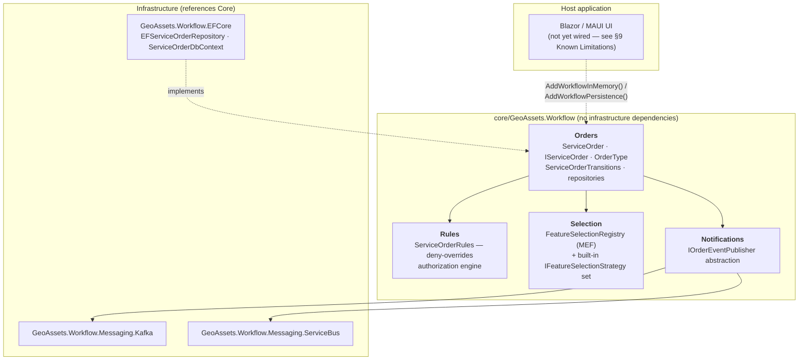
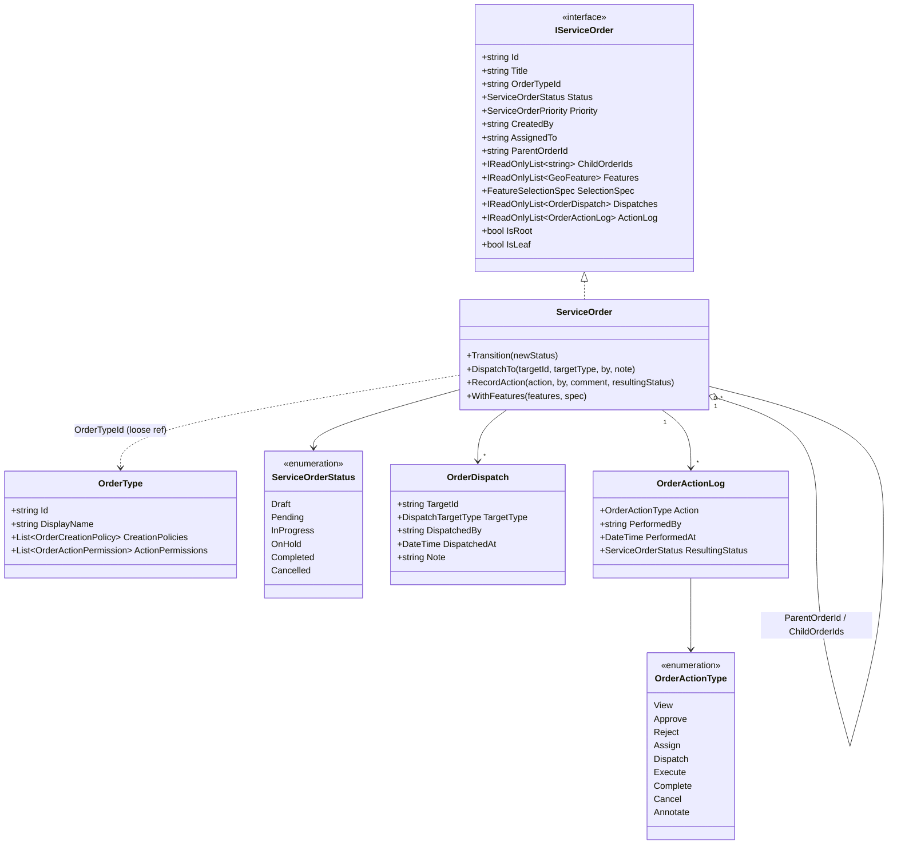
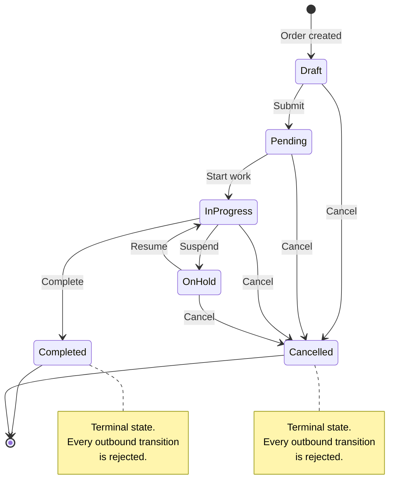
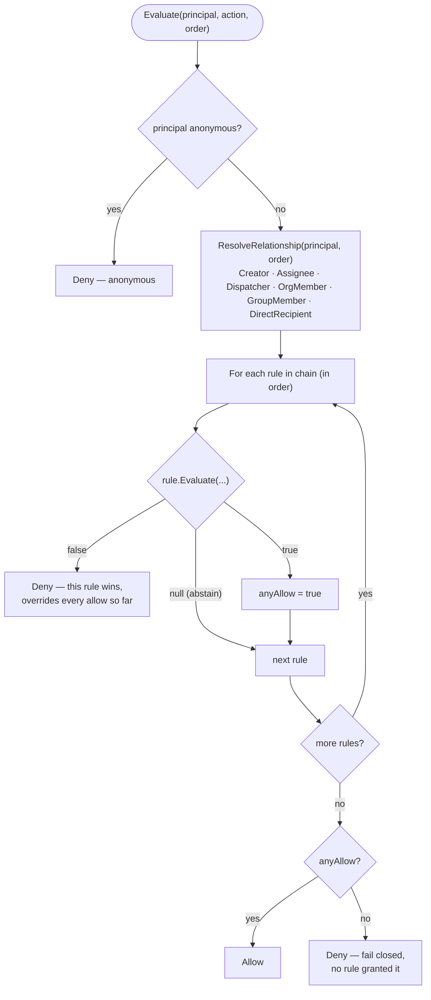
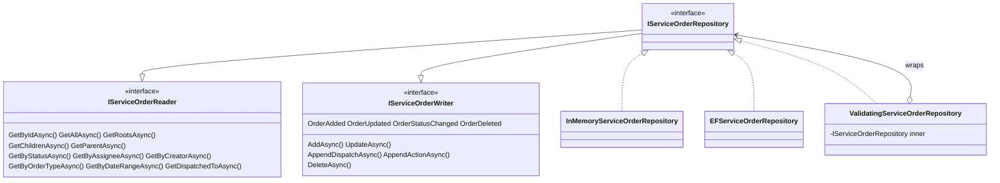
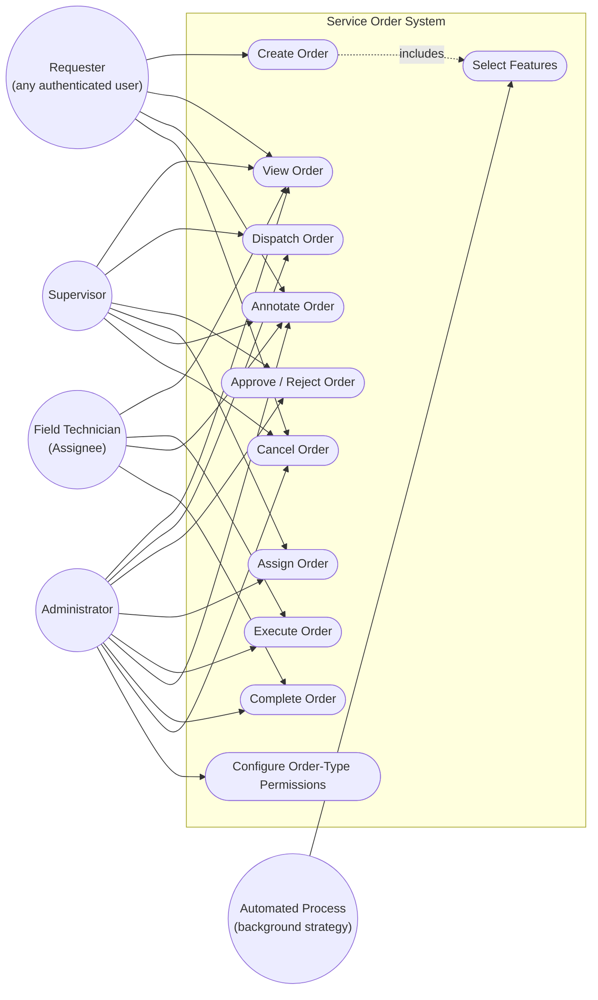
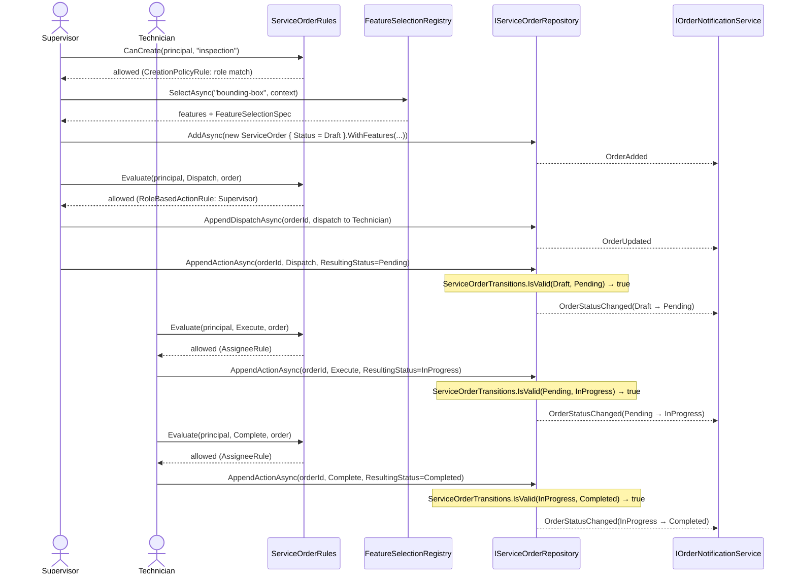

# Service Order — Design Reference

This document describes the design of the **Service Order** module — the workflow
orchestration layer for field/analytical work over georeferenced assets. It covers
the domain model, the authorization engine, the feature-selection subsystem, the
persistence layer, and the end-to-end flow, with diagrams for the status lifecycle,
the actors/use-cases, and a representative operational sequence.

The module lives in `core/GeoAssets.Workflow` (domain, rules, selection — no
infrastructure dependencies) and `workflow/GeoAssets.Workflow.EFCore` /
`workflow/GeoAssets.Workflow.Messaging.*` (persistence and messaging
infrastructure, referencing the core module).

---

## 1. What a Service Order is

A **Service Order** represents a unit of field or analytical work over a set of
`GeoFeature`s — e.g. "inspect these three transformers," "trace the impact of a
valve failure downstream," "repair this hydrant." An order:

- owns a collection of `GeoFeature`s (the assets involved),
- carries standard workflow metadata (status, priority, timestamps, assignee),
- can participate in a parent/child hierarchy (a roll-up order with per-network-segment
  child orders, for example),
- records **how** its feature set was populated (which selection strategy, with which
  parameters) for audit and reproducibility,
- accumulates a dispatch history and an append-only action log.

---

## 2. Architecture at a glance



| Layer | Responsibility | Key types |
|---|---|---|
| **Orders** | Domain model, status legality, persistence contracts | `ServiceOrder`, `IServiceOrder`, `OrderType`, `ServiceOrderTransitions`, `IServiceOrderRepository` |
| **Rules** | *Who* may perform an action, per order and per order type | `ServiceOrderRules`, `IServiceOrderRule`, `IOrderCreationRule` |
| **Selection** | Populating an order's feature set, pluggably | `FeatureSelectionRegistry`, `IFeatureSelectionStrategy` |
| **Notifications** | Publishing state-change events to a transport | `IOrderEventPublisher`, `OrderNotificationService` |
| **EFCore** | Relational persistence | `EFServiceOrderRepository`, `ServiceOrderDbContext` |
| **Messaging.\*** | Kafka / Azure Service Bus transports | `KafkaOrderEventPublisher`, `ServiceBusOrderEventPublisher` |

---

## 3. Domain model



Notes on the model, reflecting decisions made while hardening it:

- **`ParentOrderId` is the only persisted source of truth for hierarchy.**
  `ChildOrderIds` is a *derived* view, recomputed by every repository on every read —
  never write to it directly.
- **`FeatureSelectionSpec`** (on `SelectionSpec`) records which
  `IFeatureSelectionStrategy` populated `Features` and with what parameters, so the
  selection can be audited (see §5).
- **`OrderType`** carries two independent policy tables:
  `CreationPolicies` (who may create an order of this type) and `ActionPermissions`
  (per-action overrides, consulted by `ServiceOrderRules` — see §4).

### File map

| Concept | Path |
|---|---|
| Domain entity | `core/GeoAssets.Workflow/Orders/ServiceOrder.cs` |
| Domain interface | `core/GeoAssets.Workflow/Orders/IServiceOrder.cs` |
| Order type + policies | `core/GeoAssets.Workflow/Orders/OrderType.cs` |
| Order type catalogue | `core/GeoAssets.Workflow/Orders/OrderTypeRegistry.cs` |
| Status enum | `core/GeoAssets.Workflow/Orders/ServiceOrderStatus.cs` |
| Priority enum | `core/GeoAssets.Workflow/Orders/ServiceOrderPriority.cs` |
| Action enum | `core/GeoAssets.Workflow/Orders/OrderActionType.cs` |
| Dispatch record | `core/GeoAssets.Workflow/Orders/OrderDispatch.cs` |
| Audit log record | `core/GeoAssets.Workflow/Orders/OrderActionLog.cs` |
| State machine | `core/GeoAssets.Workflow/Orders/ServiceOrderTransitions.cs` |

---

## 4. Status lifecycle — the flow of a Service Order

Every legal status transition is defined in one place, `ServiceOrderTransitions.IsValid`,
and enforced at **every** write path that can change `Status` — the domain entity
(`ServiceOrder.Transition`), both repository implementations' `UpdateAsync`/
`AppendActionAsync`, and the `ValidatingServiceOrderRepository` decorator that wraps
any future implementation automatically.



Any transition not shown above — skipping straight from `Draft` to `Completed`,
re-opening a `Completed`/`Cancelled` order, moving backward from `InProgress` to
`Pending` — throws `InvalidServiceOrderTransitionException` before anything is
mutated or persisted. Staying in the same status is always a legal no-op (used by
plain metadata updates that don't touch `Status`).

---

## 5. Authorization — the rules engine

`ServiceOrderRules` is a **deny-overrides** evaluator over a chain of
`IServiceOrderRule` instances (for actions on an existing order) and a parallel
chain of `IOrderCreationRule` instances (for creating a new order, which has no
`IServiceOrder` yet).



### Built-in `IServiceOrderRule` chain (registration order)

| Rule | Grants | Notes |
|---|---|---|
| `CreatorRule` | View, Annotate to the creator; Cancel while `Draft`/`Pending` | Only status-aware built-in rule |
| `AssigneeRule` | View, Execute, Complete, Annotate to the assignee | |
| `DispatchRecipientRule` | View, Annotate to direct/group/org dispatch recipients | |
| `OrderTypeActionPermissionRule` | Per-`OrderType.ActionPermissions` override | **Overrides** the role-based default below when the order's type defines an entry for the action being evaluated; abstains otherwise |
| `RoleBasedActionRule` | Configurable role → action-set mapping (default: `Supervisor` → View/Approve/Reject/Assign/Dispatch/Cancel/Annotate; `Administrator` → everything) | Mapping is data, injected via `ServiceOrderRules`'s constructor — no code change needed to narrow or add a role tier |

### Built-in `IOrderCreationRule` chain

| Rule | Grants |
|---|---|
| `CreationPolicyRule` | Creation when the principal satisfies at least one `OrderType.CreationPolicies` entry (any-match), or unconditionally when none are defined. Abstains (not denies) when unsatisfied, so a custom creation rule can still grant access another way. |

`PolicyKind` (used by both `CreationPolicies` and `ActionPermissions`) matches on
`Role`, `Permission`, `Group`, or `Organization` against a `WorkflowPrincipal` — a
snapshot record deliberately decoupled from `GeoAssets.Identity`, so the workflow
core has no dependency on any specific identity system.

### File map

| Concept | Path |
|---|---|
| Engine | `core/GeoAssets.Workflow/Rules/ServiceOrderRules.cs` |
| Action-rule contract | `core/GeoAssets.Workflow/Rules/IServiceOrderRule.cs` |
| Creation-rule contract | `core/GeoAssets.Workflow/Rules/IOrderCreationRule.cs` |
| Principal snapshot | `core/GeoAssets.Workflow/Rules/WorkflowPrincipal.cs` |
| Relationship flags | `core/GeoAssets.Workflow/Rules/OrderUserRelationship.cs` |

---

## 6. Feature selection — populating an order

`FeatureSelectionRegistry` discovers `IFeatureSelectionStrategy` implementations via
MEF — built-in assemblies plus any `GeoAssets.Plugin.*.dll` dropped in a plugins
directory — so new strategies are added without modifying the registry.

| Strategy ID | Category | What it does |
|---|---|---|
| `bounding-box` | Spatial | Features inside a drawn rectangle |
| `nearby` | Spatial | Features within a radius of a point |
| `asset-type-filter` | Filter | All features of a given asset type |
| `manual` | Interactive | Explicit list of feature IDs |
| `topology-reachability` | Topology | Upstream/downstream/both from a seed feature |
| `inherit-parent` | Hierarchy | Copies (optionally filtered) the parent order's features |
| `inherit-children` | Hierarchy | Merges all direct child orders' features |
| *(abstract)* `BackgroundProcessSelectionStrategy` | — | Base class for long-running strategies with progress reporting |

Every call to `FeatureSelectionRegistry.SelectAsync` validates that the strategy's
`Parameters` are JSON-serializable **before** running it, so a non-serializable
parameter (a delegate, for instance) fails immediately at the call site instead of
much later when the resulting `FeatureSelectionSpec` is persisted.

---

## 7. Persistence

`IServiceOrderRepository` composes two segregated interfaces so a consumer that only
reads or only writes can depend on just that piece:



- **`UpdateAsync`** persists scalar fields only (title, status, priority, assignee,
  schedule, attributes, features, hierarchy) — it never touches `Dispatches` or
  `ActionLog`.
- **`AppendDispatchAsync`** / **`AppendActionAsync`** insert a single new row each,
  independent of any other concurrent write — replacing an earlier design that tried
  to infer "what's new" by comparing collection lengths, which could silently drop
  an entry under concurrent writers.
- **`ValidatingServiceOrderRepository`** decorates any inner repository with
  transition-legality enforcement on `UpdateAsync`/`AppendActionAsync`, so a future
  implementation gets the guarantee automatically instead of having to reimplement
  it. `AddWorkflowInMemory()` and `AddWorkflowPersistence()` register it by default.

---

## 8. Notifications

`IOrderNotificationService` builds an `OrderStateChangedEvent` (enriched with the
resolved recipient list) and hands it to an `IOrderEventPublisher`:

| Publisher | Transport | Registration |
|---|---|---|
| `NullOrderEventPublisher` | No-op (default) | `AddWorkflowNotifications()` |
| `KafkaOrderEventPublisher` | Apache Kafka | `AddWorkflowKafka(opts => ...)` |
| `ServiceBusOrderEventPublisher` | Azure Service Bus | `AddWorkflowServiceBus(configuration)` |

The domain and rules layers have zero dependency on any messaging SDK — swapping
transports never touches call sites.

---

## 9. Use cases



Which actions a role may perform is not hardcoded per actor above the built-in
defaults — see §5. `UC11` (configuring `OrderType.ActionPermissions`) is what lets an
administrator narrow or extend any of the other use cases *per order type* without a
code change.

---

## 10. End-to-end flow — worked example

A Supervisor creates an inspection order, dispatches it, and a Field Technician
executes and completes it:



If the Technician instead attempted `AppendActionAsync(orderId, Complete,
ResultingStatus=Completed)` while the order was still `Draft`, the repository would
throw `InvalidServiceOrderTransitionException` before mutating anything — the same
enforcement shown in §4 applies regardless of which action triggered the attempt.

---

## 11. Registering the module

```csharp
// In-memory (WASM hosts, tests) — no database required.
services.AddWorkflowInMemory();
services.AddOrderTypeRegistry();           // seeds "inspection", "maintenance", "emergency-repair"
services.AddWorkflowNotifications();       // no-op publisher by default

// EF Core-backed (server-side hosts).
services.AddWorkflowPersistence(o => o.UseSqlServer(connectionString));
services.AddWorkflowKafka(opts => { opts.BootstrapServers = "..."; opts.TopicName = "..."; });
// or: services.AddWorkflowServiceBus(configuration);
```

Both `AddWorkflowInMemory()` and `AddWorkflowPersistence()` register
`IServiceOrderRepository` as a `ValidatingServiceOrderRepository` wrapping the
concrete implementation, and separately register `IServiceOrderReader` /
`IServiceOrderWriter` pointing at that same instance.

---

## 12. Testing

`GeoAssets.Workflow.Tests` covers the module end to end — 177 test cases as of this
writing, with `InMemoryServiceOrderRepository`, `ServiceOrder` (transition logic),
`ServiceOrderTransitions`, `ServiceOrderRules`, `FeatureSelectionRegistry` (parameter
validation), and `ValidatingServiceOrderRepository` all at 100% line/branch coverage.
The full solution (`GeoAssets.Core.Tests` + `GeoAssets.Workflow.Tests` +
`GeoAssets.Commands.Tests`) runs 406 tests.

---

## 13. Known limitations

- **Not yet wired into any host.** No project under `apps/` references
  `GeoAssets.Workflow` — this module has no UI today. Confirmed intentional
  pre-`v0.1.0` sequencing (see the project README's roadmap), not a stalled
  integration — but worth knowing before assuming a page exists to click through.
- **`FeatureSelectionSpec.Parameters` doesn't survive a reload with full type
  fidelity.** Every parameter value comes back as a `System.Text.Json.JsonElement`
  after a save/reload cycle, regardless of its original CLR type — strategies with
  hard casts (`(GeoPoint)`, `(TraversalDirection)`) would throw if fed a reloaded
  spec instead of a freshly-built one. `Parameters` is safe for audit/display, not
  for literal replay.
- **No optimistic concurrency token.** Two concurrent `UpdateAsync` calls editing
  different scalar fields on the same order still resolve last-writer-wins with no
  conflict signal. The append-only writer methods (§7) close the sharper version of
  this problem (silently dropped audit-log rows); the general case is still open.
